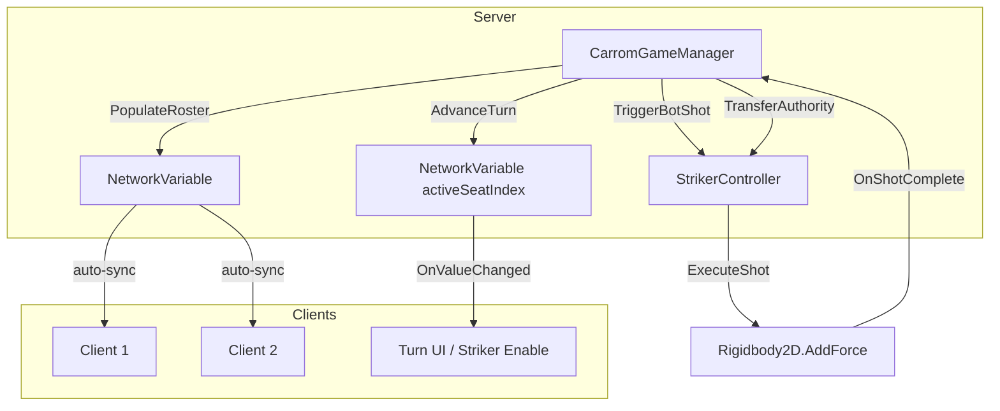

# Design Document — 4-Seat Roster & Command Pattern

## Overview

This design upgrades `CarromGameManager` and `StrikerController` from a binary 2-player turn model to a server-authoritative 4-seat roster. The core changes are:

1. Replace `NetworkVariable<bool> networkPlayerTurn` with `NetworkVariable<int> activeSeatIndex` backed by a `SeatData[4]` roster.
2. Wrap the roster in an `INetworkSerializable` struct (`RosterState`) so NGO handles late-joiner sync automatically.
3. Extract shot physics from the mouse-release inline path into a standalone `ExecuteShot(Vector2, float)` command method callable identically by human UI and AI bots.
4. Replace the two binary score variables with four independent per-seat `NetworkVariable<int>` scores.

The existing `TransferAuthority` → `FlipTurn` → `GetCurrentActivePlayerId` chain is replaced by `TransferAuthority` → `AdvanceTurn` → `GetActiveSeatOwnerClientId`.

---

## Architecture



**Key invariants:**
- Only the Server writes `activeSeatIndex` and `rosterState`.
- `AdvanceTurn` is strictly `(activeSeatIndex.Value + 1) % 4`, skipping `Closed` seats.
- `SeatPriority [0,2,1,3]` is used **only** in `PopulateRoster()`.
- `ExecuteShot` is the single entry point for all shot physics — human and bot.

---

## Components and Interfaces

### CarromGameManager changes

| Member | Change |
|---|---|
| `networkPlayerTurn` | Removed — replaced by `activeSeatIndex` |
| `networkScorePlayer` / `networkScoreEnemy` | Removed — replaced by `score0`–`score3` |
| `NetworkVariable<int> activeSeatIndex` | New — server-write, everyone-read |
| `NetworkVariable<RosterState> rosterState` | New — server-write, everyone-read |
| `score0`, `score1`, `score2`, `score3` | New `NetworkVariable<int>` per seat |
| `SeatData[] Roster` | New server-side array (4 elements) |
| `PopulateRoster()` | New — called from `OnNetworkSpawn` on server |
| `AdvanceTurn()` | New — replaces `FlipTurn()` |
| `RetainCurrentSeat()` | New — replaces the retain-turn branch in `TransferAuthority` |
| `TriggerBotShot(SeatData)` | New — server-only AI shot dispatch |
| `GetActiveSeatOwnerClientId()` | New — replaces `GetCurrentActivePlayerId()` |
| `UpdateTurnDisplayClientRpc` | Signature change: `(Team team, ControllerType ct)` |

### StrikerController changes

| Member | Change |
|---|---|
| `ExecuteShot(Vector2, float)` | New public method — canonical shot entry point |
| `ResetToBaseline(int seatIndex)` | Signature change: accepts seat index for axis-aware positioning |
| `FireShot` coroutine | Refactored to call `ExecuteShot` instead of inline physics |
| `OnLostOwnership` | Updated to use seat-aware baseline |

### New types (defined in CarromGameManager.cs)

```csharp
public enum ControllerType { Human_Local, Human_Network, AI_Bot, Closed }
public enum Team { White, Black }

public struct SeatData : INetworkSerializable
{
    public byte           SeatIndex;
    public ControllerType ControllerType;
    public Team           Team;
    public ulong          OwnerClientId;

    public void NetworkSerialize<T>(BufferSerializer<T> serializer) where T : IReaderWriter
    {
        serializer.SerializeValue(ref SeatIndex);
        serializer.SerializeValue(ref ControllerType);
        serializer.SerializeValue(ref Team);
        serializer.SerializeValue(ref OwnerClientId);
    }
}

public struct RosterState : INetworkSerializable
{
    public SeatData Seat0, Seat1, Seat2, Seat3;

    public SeatData this[int i] => i switch { 0 => Seat0, 1 => Seat1, 2 => Seat2, _ => Seat3 };

    public void NetworkSerialize<T>(BufferSerializer<T> serializer) where T : IReaderWriter
    {
        serializer.SerializeValue(ref Seat0);
        serializer.SerializeValue(ref Seat1);
        serializer.SerializeValue(ref Seat2);
        serializer.SerializeValue(ref Seat3);
    }
}
```

> `RosterState` uses four named fields instead of an array because NGO's `BufferSerializer` does not support array serialization directly without manual length encoding.

---

## Data Models

### SeatData

| Field | Type | Notes |
|---|---|---|
| `SeatIndex` | `byte` | 0–3 |
| `ControllerType` | `ControllerType` | Human_Local, Human_Network, AI_Bot, Closed |
| `Team` | `Team` | White or Black |
| `OwnerClientId` | `ulong` | 0 = server/bot authority |

### Roster population rules

`SeatPriority = [0, 2, 1, 3]`

- First `(PendingPlayerCount - PendingBotCount)` priority slots → Human seats, assigned from `ConnectedClientsIds` in order.
- Next `PendingBotCount` priority slots → AI_Bot seats, `OwnerClientId = 0`.
- Remaining slots → `Closed`.

**Team assignment:**

| PendingPlayerCount | Seat 0 | Seat 1 | Seat 2 | Seat 3 |
|---|---|---|---|---|
| 2 | White | Closed | Black | Closed |
| ≥ 3 | White | Black | White | Black |

### Per-seat scores

```
score0, score1, score2, score3 : NetworkVariable<int>
```

- Freestyle: `score[activeSeatIndex.Value] += points`
- Classic White total: `score0.Value + score2.Value`
- Classic Black total: `score1.Value + score3.Value`

### AdvanceTurn algorithm

```
next = (activeSeatIndex.Value + 1) % 4
iterations = 0
while Roster[next].ControllerType == Closed:
    next = (next + 1) % 4
    iterations++
    if iterations >= 4: log error; return  // all closed guard
activeSeatIndex.Value = next
```

### Striker baseline positions by seat

| Seat | Side | Axis | Position |
|---|---|---|---|
| 0 | South | X-axis movement | Y = -4.57f |
| 1 | East | Y-axis movement | X = east rail value |
| 2 | North | X-axis movement | Y = 3.45f |
| 3 | West | Y-axis movement | X = west rail value |

---

## Correctness Properties

*A property is a characteristic or behavior that should hold true across all valid executions of a system — essentially, a formal statement about what the system should do. Properties serve as the bridge between human-readable specifications and machine-verifiable correctness guarantees.*

### Property 1: RosterState serialization round-trip

*For any* valid `RosterState` value, serializing it with `NetworkSerialize` and then deserializing it should produce a structurally equal value.

**Validates: Requirements 1.2, 9.1**

### Property 2: PopulateRoster fills exactly PendingPlayerCount active seats

*For any* valid `PendingPlayerCount` (1–4) and `PendingBotCount` (0–PendingPlayerCount), after `PopulateRoster()` runs, the number of non-`Closed` seats in the roster should equal `PendingPlayerCount`.

**Validates: Requirements 2.1, 2.2, 2.3, 2.4**

### Property 3: Team assignment invariant

*For any* roster populated with `PendingPlayerCount == 2`, seat 0 is `Team.White` and seat 2 is `Team.Black`. *For any* roster populated with `PendingPlayerCount >= 3`, seats 0 and 2 are `Team.White` and seats 1 and 3 are `Team.Black`.

**Validates: Requirements 1.5, 2.6**

### Property 4: AdvanceTurn never lands on a Closed seat

*For any* roster with at least one non-`Closed` seat, calling `AdvanceTurn()` any number of times should always result in `activeSeatIndex` pointing to a non-`Closed` seat.

**Validates: Requirements 3.2, 3.3**

### Property 5: 2-player match alternates between seat 0 and seat 2

*For any* 2-player roster (seats 1 and 3 are `Closed`), repeated calls to `AdvanceTurn()` should strictly alternate `activeSeatIndex` between 0 and 2.

**Validates: Requirements 8.2**

### Property 6: ExecuteShot is the single physics entry point

*For any* shot triggered by human input or bot logic, the resulting `Rigidbody2D.AddForce` call should only occur inside `ExecuteShot`, never inline in the mouse-release or bot path.

**Validates: Requirements 4.1, 4.2, 4.3, 5.3**

### Property 7: Freestyle per-seat score credit

*For any* active seat index and any set of pocketed coins in Freestyle mode, the score credited after `EvaluateFreestyleMode()` should be added to `score[activeSeatIndex.Value]` and no other score variable.

**Validates: Requirements 6.2, 6.3**

### Property 8: Classic team score aggregation

*For any* roster state, the Classic White team score should equal `score0.Value + score2.Value` and the Classic Black team score should equal `score1.Value + score3.Value`.

**Validates: Requirements 6.4**

### Property 9: Active seat authority resolution

*For any* client, when `activeSeatIndex` changes, the striker UI should be enabled if and only if `LocalClientId == Roster[activeSeatIndex.Value].OwnerClientId`.

**Validates: Requirements 7.1, 7.2, 7.3**

### Property 10: ResetToBaseline is axis-aware

*For any* seat index, `ResetToBaseline(seatIndex)` should set the striker's Y position for seats 0 and 2, and the striker's X position for seats 1 and 3.

**Validates: Requirements 10.3, 10.4**

---

## Error Handling

| Condition | Handling |
|---|---|
| `PendingPlayerCount < 1 or > 4` | Log error, default to 2-seat human layout |
| All seats `Closed` in `AdvanceTurn` | Log error, leave `activeSeatIndex` unchanged |
| `ConnectedClientsIds` has fewer entries than human seat count | Fill remaining human slots as `AI_Bot` with a warning |
| `TriggerBotShot` called on non-server | Early return with `Debug.LogError` |
| `ExecuteShot` called when `!IsOwner && !IsServer` | Early return, no physics applied |
| `GetActiveSeatOwnerClientId` called before roster populated | Return `ulong.MaxValue` |

---

## Testing Strategy

### Unit tests (NUnit, Unity Test Framework)

Focus on specific examples, edge cases, and error conditions:

- `SeatData` serialization with known field values
- `PopulateRoster` with `PendingPlayerCount = 2, 3, 4` and mixed bot counts
- `AdvanceTurn` with all-closed guard (error path)
- `AdvanceTurn` 2-player alternation over 10 iterations
- `EvaluateFreestyleMode` credits correct seat score variable
- `EvaluateClassicMode` aggregates White/Black team totals correctly
- `ResetToBaseline` sets Y for seats 0/2 and X for seats 1/3

### Property-based tests (Unity Test Framework + FsCheck or fast-check via JS bridge)

Each property test runs a minimum of **100 iterations** with randomized inputs.

Tag format: `// Feature: 4-seat-roster-command-pattern, Property N: <property text>`

| Property | Test description |
|---|---|
| P1 | Generate random `RosterState`, serialize → deserialize, assert structural equality |
| P2 | Generate random valid `(PendingPlayerCount, PendingBotCount)`, run `PopulateRoster`, count non-Closed seats |
| P3 | Generate random `PendingPlayerCount`, run `PopulateRoster`, assert team assignments |
| P4 | Generate random roster with ≥1 open seat, call `AdvanceTurn` N times, assert never lands on Closed |
| P5 | 2-player roster, call `AdvanceTurn` 20 times, assert strict 0↔2 alternation |
| P6 | Structural: verify `FireShot` coroutine and bot path both route through `ExecuteShot` (code inspection test) |
| P7 | Generate random `activeSeatIndex` and coin list, run `EvaluateFreestyleMode`, assert only `score[active]` changed |
| P8 | Generate random `score0`–`score3` values, assert White = s0+s2, Black = s1+s3 |
| P9 | Generate random roster and `LocalClientId`, assert UI enable ↔ ownership match |
| P10 | Generate random seat index 0–3, call `ResetToBaseline`, assert correct axis was set |
