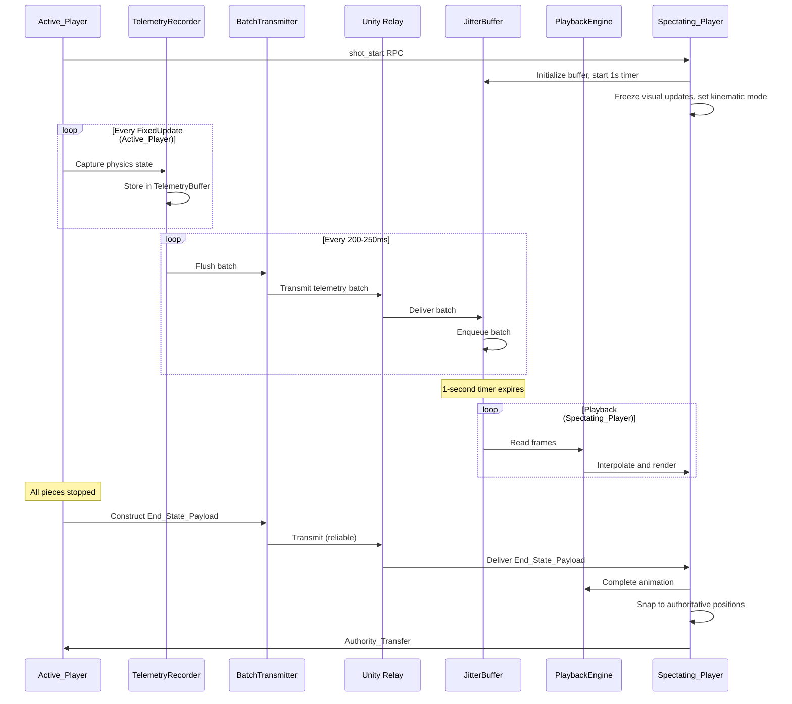

# Design Document: Asynchronous Telemetry Replay Physics

## Overview

This design implements an asynchronous telemetry replay architecture for the Unity Carrom multiplayer game that eliminates physics synchronization lag. The system replaces the current server-authoritative continuous physics synchronization with a recording-and-replay model where:

- The Active_Player (player with network authority) experiences zero-latency local physics simulation
- The Spectating_Player receives telemetry data batches and reconstructs the shot through smooth interpolated playback after a 1-second buffer period
- Final board state is guaranteed to be identical on both clients through authoritative end-state synchronization

The architecture integrates with the existing Unity Netcode for GameObjects (NGO) and Unity Relay infrastructure, leveraging the current `NetworkPhysicsObject`, `CarromGameManager`, and `StrikerController` components while adding new telemetry recording, transmission, and playback systems.

### Key Design Decisions

1. **Authority-Based Physics Isolation**: Only the Active_Player runs Box2D physics; the Spectating_Player sets all Rigidbody2D components to kinematic mode to prevent local physics calculations
2. **Allocation-Free Recording**: Pre-allocated ring buffers using struct-based frame records prevent garbage collection during gameplay
3. **Micro-Batched Transmission**: Telemetry frames are aggregated into 200-250ms batches to balance network efficiency with playback smoothness
4. **Jitter Buffer with Fixed Delay**: 1-second buffer on the Spectating_Player absorbs network timing variations before playback begins
5. **Interpolated Playback**: Visual rendering uses Vector2.Lerp and Mathf.LerpAngle at display framerate, decoupled from physics simulation rate
6. **Authoritative End-State**: Final positions transmitted via reliable channel override any interpolation discrepancies

## Architecture

### Component Hierarchy

```
CarromGameManager (existing, modified)
├── TelemetryRecorder (new)
│   └── TelemetryBuffer (new)
├── BatchTransmitter (new)
├── JitterBuffer (new)
└── PlaybackEngine (new)

NetworkPhysicsObject (existing, modified)
├── Authority-based physics mode switching
└── Visual transform decoupling

StrikerController (existing, modified)
└── Shot initiation signaling
```

### Data Flow



## Components and Interfaces

### TelemetryRecorder

**Responsibility**: Captures physics state data during the Active_Player's turn without heap allocations.

**Class Definition**:
```csharp
public class TelemetryRecorder : MonoBehaviour
{
    private TelemetryBuffer buffer;
    private bool isRecording;
    private float velocityThreshold = 0.1f;
    
    public void StartRecording();
    public void StopRecording();
    public void CaptureFrame();
    public PhysicsFrame[] GetRecordedFrames(int startIndex, int count);
    public void ResetBuffer();
}
```

**Key Methods**:
- `StartRecording()`: Initializes recording state when shot begins
- `CaptureFrame()`: Called every FixedUpdate to record moving piece states
- `StopRecording()`: Halts recording when all pieces are stationary
- `GetRecordedFrames()`: Retrieves frames for batch transmission without copying

**Integration Points**:
- Called by `StrikerController` when shot is initiated
- Invoked during `FixedUpdate` on Active_Player only
- Interfaces with `BatchTransmitter` for frame retrieval

### TelemetryBuffer

**Responsibility**: Pre-allocated storage for physics frames using allocation-free data structures.

**Class Definition**:
```csharp
public struct PieceState
{
    public byte pieceId;
    public float xPosition;
    public float yPosition;
    public float zRotation;
}

public struct PhysicsFrame
{
    public float timestamp;
    public int pieceCount;
    public PieceState[] pieces; // Fixed-size array
}

public class TelemetryBuffer
{
    private PhysicsFrame[] frames;
    private int capacity;
    private int writeIndex;
    private int readIndex;
    private int count;
    
    public TelemetryBuffer(int capacity, int maxPiecesPerFrame);
    public bool TryAddFrame(PhysicsFrame frame);
    public bool TryGetFrames(int count, out PhysicsFrame[] frames);
    public void Clear();
}
```

**Key Design Choices**:
- Ring buffer implementation with fixed capacity (default: 300 frames = ~6 seconds at 50 FPS)
- Struct-based `PieceState` and `PhysicsFrame` to avoid heap allocations
- Pre-allocated arrays for piece states within each frame
- Capacity expansion triggers immediate batch transmission if buffer fills

### BatchTransmitter

**Responsibility**: Aggregates recorded frames into network-efficient batches and transmits via Unity Relay.

**Class Definition**:
```csharp
public class BatchTransmitter : NetworkBehaviour
{
    private float batchInterval = 0.225f; // 225ms
    private float lastBatchTime;
    private TelemetryRecorder recorder;
    
    public void TransmitBatch();
    public void TransmitEndState(EndStatePayload payload);
    
    [ClientRpc]
    private void ReceiveTelemetryBatchClientRpc(byte[] serializedBatch, ClientRpcParams clientRpcParams);
    
    [ClientRpc]
    private void ReceiveEndStateClientRpc(EndStatePayload payload);
}
```

**Key Methods**:
- `TransmitBatch()`: Serializes and sends accumulated frames via Reliable Sequenced channel
- `TransmitEndState()`: Sends final authoritative positions via Reliable channel
- `ReceiveTelemetryBatchClientRpc()`: Delivers batch to Spectating_Player's JitterBuffer
- `ReceiveEndStateClientRpc()`: Delivers end state to Spectating_Player

**Network Configuration**:
- Telemetry batches: Reliable Sequenced delivery (Unity Relay default)
- End state payload: Reliable delivery with acknowledgment
- Compression: Applied if payload size reduction exceeds 20%

### JitterBuffer

**Responsibility**: Buffers incoming telemetry batches on the Spectating_Player before playback begins.

**Class Definition**:
```csharp
public class JitterBuffer : MonoBehaviour
{
    private Queue<PhysicsFrame[]> batchQueue;
    private float bufferDuration = 1.0f;
    private float bufferStartTime;
    private bool isBuffering;
    
    public void Initialize();
    public void EnqueueBatch(PhysicsFrame[] frames);
    public bool IsBufferReady();
    public PhysicsFrame GetNextFrame();
    public void Clear();
}
```

**Key Methods**:
- `Initialize()`: Starts buffer timer when shot_start RPC is received
- `EnqueueBatch()`: Stores incoming batches in arrival order
- `IsBufferReady()`: Returns true when 1-second timer expires
- `GetNextFrame()`: Provides frames to PlaybackEngine in sequence

**Configuration**:
- Default buffer duration: 1.0 seconds
- Configurable range: 0.5 to 2.0 seconds (inspector-exposed)
- Warning logged if batch arrival exceeds 500ms delay

### PlaybackEngine

**Responsibility**: Interpolates and renders piece movements on the Spectating_Player at display framerate.

**Class Definition**:
```csharp
public class PlaybackEngine : MonoBehaviour
{
    private JitterBuffer jitterBuffer;
    private Dictionary<byte, GameObject> pieceRegistry;
    private PhysicsFrame currentFrame;
    private PhysicsFrame nextFrame;
    private float frameProgress;
    
    public void StartPlayback();
    public void UpdatePlayback();
    public void ApplyEndState(EndStatePayload payload);
    private void InterpolatePiece(byte pieceId, Vector2 startPos, Vector2 endPos, float startRot, float endRot);
}
```

**Key Methods**:
- `StartPlayback()`: Begins rendering when jitter buffer is ready
- `UpdatePlayback()`: Called every frame to interpolate positions/rotations
- `ApplyEndState()`: Snaps all pieces to authoritative final positions
- `InterpolatePiece()`: Uses Vector2.Lerp and Mathf.LerpAngle for smooth motion

**Interpolation Strategy**:
- Position: `Vector2.Lerp(startPos, endPos, frameProgress)`
- Rotation: `Mathf.LerpAngle(startRot, endRot, frameProgress)`
- Frame progress calculated based on elapsed time and frame timestamps
- Directly modifies Transform components, not Rigidbody2D

### Modified: NetworkPhysicsObject

**Existing Functionality**: Currently sets clients to kinematic mode with server-authoritative physics.

**New Functionality**:
- Authority-based mode switching: Dynamic mode for Active_Player, kinematic for Spectating_Player
- Visual transform decoupling: Allows PlaybackEngine to modify Transform without affecting Rigidbody2D
- Authority transfer handling: Switches between dynamic/kinematic on turn transitions

**Modified Class**:
```csharp
public class NetworkPhysicsObject : NetworkBehaviour
{
    private Rigidbody2D rb;
    private bool hasAuthority;
    
    public override void OnNetworkSpawn();
    public void SetAuthority(bool isActive);
    public void SetKinematicMode(bool kinematic);
    public void SetVisualTransform(Vector2 position, float rotation);
}
```

**New Methods**:
- `SetAuthority(bool)`: Switches between active (dynamic) and spectating (kinematic) modes
- `SetKinematicMode(bool)`: Directly controls Rigidbody2D kinematic state
- `SetVisualTransform()`: Updates Transform without physics interaction

### Modified: CarromGameManager

**Existing Functionality**: Manages turn state, scores, and game flow.

**New Functionality**:
- Instantiates and manages telemetry system components
- Coordinates authority transfers between players
- Detects shot completion based on velocity threshold
- Triggers end-state synchronization

**New Fields**:
```csharp
private TelemetryRecorder telemetryRecorder;
private BatchTransmitter batchTransmitter;
private JitterBuffer jitterBuffer;
private PlaybackEngine playbackEngine;
private float velocityThreshold = 0.1f;
```

**New Methods**:
```csharp
public void OnShotStart();
public void OnShotComplete();
public void TransferAuthority();
private EndStatePayload ConstructEndState();
```

### Modified: StrikerController

**Existing Functionality**: Handles striker input, charging, and shooting.

**New Functionality**:
- Sends shot_start RPC to Spectating_Player
- Triggers telemetry recording on shot initiation
- Notifies CarromGameManager when shot completes

**New Methods**:
```csharp
[ClientRpc]
private void NotifyShotStartClientRpc();
```

## Data Models

### PieceState

Represents the state of a single game piece at a specific moment.

```csharp
public struct PieceState
{
    public byte pieceId;        // Unique identifier (0-255)
    public float xPosition;     // X coordinate
    public float yPosition;     // Y coordinate
    public float zRotation;     // Z-axis rotation in degrees
}
```

**Size**: 13 bytes (1 + 4 + 4 + 4)

### PhysicsFrame

Represents all moving pieces at a single FixedUpdate step.

```csharp
public struct PhysicsFrame
{
    public float timestamp;           // Time since shot start
    public int pieceCount;            // Number of moving pieces
    public PieceState[] pieces;       // Fixed-size array (max 20 pieces)
}
```

**Size**: Variable, max ~268 bytes (4 + 4 + 20 * 13)

### TelemetryBatch

Network payload containing multiple physics frames.

```csharp
public struct TelemetryBatch
{
    public int frameCount;
    public PhysicsFrame[] frames;     // Typically 10-12 frames per batch
}
```

**Serialization**: Binary format with frame count header followed by frame data

### EndStatePayload

Authoritative final state for all game pieces.

```csharp
public struct EndStatePayload
{
    public int pieceCount;
    public PieceState[] finalStates;  // All pieces (moving and stationary)
}
```

**Size**: Variable, max ~268 bytes for 20 pieces

### Piece ID Registry

Mapping between piece IDs and GameObject references.

```csharp
public class PieceRegistry
{
    private Dictionary<byte, GameObject> idToPiece;
    private Dictionary<GameObject, byte> pieceToId;
    
    public void RegisterPiece(byte id, GameObject piece);
    public GameObject GetPiece(byte id);
    public byte GetId(GameObject piece);
}
```

**ID Assignment**:
- Striker: 0
- White coins: 1-9
- Black coins: 10-18
- Queen: 19

## Network Messaging Protocols

### Shot Start RPC

**Purpose**: Notifies Spectating_Player that opponent's shot has begun.

**Message Type**: ClientRpc (Reliable)

**Payload**: None (signal only)

**Handler**: Initializes JitterBuffer, freezes visuals, starts 1-second timer

```csharp
[ClientRpc]
private void NotifyShotStartClientRpc(ClientRpcParams clientRpcParams = default)
{
    if (!IsServer) // Spectating_Player only
    {
        jitterBuffer.Initialize();
        FreezeVisuals();
        SetAllPiecesKinematic();
    }
}
```

### Telemetry Batch RPC

**Purpose**: Transmits recorded physics frames from Active_Player to Spectating_Player.

**Message Type**: ClientRpc (Reliable Sequenced)

**Payload**: Serialized TelemetryBatch (byte array)

**Frequency**: Every 200-250ms during shot

**Handler**: Deserializes and enqueues batch in JitterBuffer

```csharp
[ClientRpc]
private void ReceiveTelemetryBatchClientRpc(byte[] serializedBatch, ClientRpcParams clientRpcParams = default)
{
    if (!IsServer) // Spectating_Player only
    {
        TelemetryBatch batch = TelemetrySerializer.Deserialize(serializedBatch);
        jitterBuffer.EnqueueBatch(batch.frames);
    }
}
```

### End State RPC

**Purpose**: Transmits authoritative final positions after shot completes.

**Message Type**: ClientRpc (Reliable)

**Payload**: EndStatePayload

**Handler**: Completes playback animation and snaps pieces to final positions

```csharp
[ClientRpc]
private void ReceiveEndStateClientRpc(EndStatePayload payload, ClientRpcParams clientRpcParams = default)
{
    if (!IsServer) // Spectating_Player only
    {
        playbackEngine.ApplyEndState(payload);
        RestoreDynamicMode();
    }
}
```

### Authority Transfer

**Purpose**: Switches network ownership between players after turn completes.

**Implementation**: Uses existing Unity Netcode `NetworkObject.ChangeOwnership()`

**Trigger**: After End_State_Payload is applied on Spectating_Player

**Process**:
1. Server calls `ChangeOwnership()` for all game piece NetworkObjects
2. New Active_Player sets Rigidbody2D to dynamic mode
3. New Spectating_Player remains in kinematic mode

## Integration with Existing Systems

### Unity Relay Integration

The system uses the existing Unity Relay connection established by `StartGameManager`:

- **Transport**: Unity Transport (UTP) with DTLS encryption
- **Channels**: Default Reliable Sequenced for telemetry, Reliable for end state
- **Allocation**: Existing 3-player allocation supports 2 players + relay server

No changes required to relay setup; telemetry RPCs use existing NGO messaging infrastructure.

### CarromGameManager Integration

Modifications to existing turn management:

1. **Turn Start**: 
   - Existing: `networkPlayerTurn.Value` switches
   - New: Call `OnShotStart()` to initialize telemetry recording

2. **Turn End**:
   - Existing: `AreAllObjectsStopped()` detects completion
   - New: Call `OnShotComplete()` to transmit end state and transfer authority

3. **Authority Management**:
   - Existing: Server-authoritative physics
   - New: Active_Player-authoritative physics with spectator replay

### NetworkPhysicsObject Integration

Current behavior:
- Server: Dynamic Rigidbody2D with physics simulation
- Client: Kinematic Rigidbody2D with interpolation

New behavior:
- Active_Player: Dynamic Rigidbody2D with local physics
- Spectating_Player: Kinematic Rigidbody2D with playback engine control

Changes:
- Replace `IsServer` checks with authority-based checks
- Add `SetAuthority()` method called during turn transitions
- Decouple visual Transform updates from Rigidbody2D state

### StrikerController Integration

Modifications to shot execution:

1. **Shot Initiation** (`OnMouseUp`):
   - Existing: Apply force to striker
   - New: Send `NotifyShotStartClientRpc()` before applying force
   - New: Call `telemetryRecorder.StartRecording()`

2. **Shot Completion** (coroutine):
   - Existing: Wait for pieces to stop, switch turn
   - New: Call `telemetryRecorder.StopRecording()`
   - New: Trigger end state transmission via `CarromGameManager`

## Memory Management Strategies

### Allocation-Free Recording

**Goal**: Prevent garbage collection spikes during gameplay by eliminating heap allocations in the recording loop.

**Strategies**:

1. **Pre-Allocated Ring Buffer**:
   - `TelemetryBuffer` allocates all frame storage during initialization
   - Fixed capacity: 300 frames (6 seconds at 50 FPS)
   - No dynamic resizing during recording

2. **Struct-Based Data Types**:
   - `PieceState` and `PhysicsFrame` are value types (structs)
   - Stored in pre-allocated arrays, not as individual heap objects
   - Copying is efficient due to small size

3. **Fixed-Size Piece Arrays**:
   - Each `PhysicsFrame` contains a fixed-size array for 20 pieces
   - Unused slots remain empty (pieceCount tracks actual usage)
   - Avoids dynamic array resizing

4. **Object Pooling for Serialization**:
   - Byte array pool for serialized batches
   - Reused across transmissions to avoid repeated allocations
   - Managed by `BatchTransmitter`

5. **Dictionary Reuse**:
   - `PieceRegistry` dictionary allocated once at game start
   - No runtime additions/removals during gameplay
   - All pieces registered during scene initialization

### Memory Budget

**Per-Frame Recording**:
- PhysicsFrame: 268 bytes (max)
- Typical: ~130 bytes (5 moving pieces average)

**Buffer Storage**:
- 300 frames × 268 bytes = 80.4 KB (max)
- Typical: 300 × 130 = 39 KB

**Batch Transmission**:
- 10-12 frames per batch = 1.3-1.6 KB
- Compressed: ~1 KB (assuming 20% reduction)

**Total Memory Overhead**: ~100 KB per client (negligible for modern devices)

### Garbage Collection Mitigation

**Avoided Allocations**:
- No `new` calls in FixedUpdate loop
- No string concatenation during recording
- No LINQ queries on hot paths
- No boxing of value types

**Profiling Checkpoints**:
- Unity Profiler: Monitor GC.Alloc in FixedUpdate
- Target: 0 bytes allocated per frame during recording
- Acceptable: <100 bytes per batch transmission (serialization overhead)


## Correctness Properties

*A property is a characteristic or behavior that should hold true across all valid executions of a system—essentially, a formal statement about what the system should do. Properties serve as the bridge between human-readable specifications and machine-verifiable correctness guarantees.*

### Property Reflection

After analyzing all acceptance criteria, I identified several redundancies:

- **Physics Isolation**: Requirements 2.1, 2.3 are equivalent (kinematic mode = disabled physics)
- **Recording Initiation**: Requirements 4.1 and 15.1 are identical
- **Velocity Threshold Filtering**: Requirements 4.2, 13.1, and 13.3 all specify the same behavior
- **Memory Allocation**: Requirements 4.4 and 4.5 both address allocation-free recording
- **Visual Decoupling**: Requirements 14.1 and 14.2 describe the same mechanism

The following properties eliminate these redundancies while maintaining comprehensive coverage.

### Property 1: Authority Exclusivity

*For any* turn state, exactly one player SHALL have network authority over all Game_Piece objects, and the other player SHALL NOT have authority over any Game_Piece.

**Validates: Requirements 1.1, 1.2**

### Property 2: Authority Persistence Until End State

*For any* shot in progress, the Active_Player SHALL maintain network authority over all Game_Pieces until the End_State_Payload is transmitted and acknowledged.

**Validates: Requirements 1.4**

### Property 3: Authority Transfer on Turn Completion

*For any* completed turn, authority SHALL transfer from the current Active_Player to the current Spectating_Player, making the Spectating_Player the new Active_Player.

**Validates: Requirements 1.3, 12.1, 12.2**

### Property 4: Kinematic Mode on Authority Loss

*For any* Game_Piece, when the owning player loses network authority, the Rigidbody2D component SHALL be set to kinematic mode.

**Validates: Requirements 2.1**

### Property 5: Kinematic Bodies Ignore Forces

*For any* Game_Piece in kinematic mode, applying physics forces SHALL NOT change the Rigidbody2D velocity or position.

**Validates: Requirements 2.2**

### Property 6: Dynamic Mode on Authority Gain

*For any* Game_Piece, when the owning player gains network authority, the Rigidbody2D component SHALL be set to dynamic mode.

**Validates: Requirements 2.4, 12.3, 12.4**

### Property 7: Local Physics Execution

*For any* shot executed by the Active_Player, physics calculations SHALL occur locally without waiting for network messages.

**Validates: Requirements 3.1**

### Property 8: Active Player Dynamic Mode Invariant

*For any* Active_Player during their turn, all Game_Piece Rigidbody2D components SHALL be in dynamic mode.

**Validates: Requirements 3.2**

### Property 9: Velocity Threshold Filtering

*For any* FixedUpdate step during recording, only Game_Pieces with velocity magnitude exceeding the Velocity_Threshold SHALL be included in the recorded PhysicsFrame.

**Validates: Requirements 4.2, 13.1, 13.3**

### Property 10: Frame Data Completeness

*For any* recorded PhysicsFrame containing a moving Game_Piece, the frame SHALL include the Piece_ID, X_Position, Y_Position, and Z_Rotation for that piece.

**Validates: Requirements 4.3**

### Property 11: Allocation-Free Recording

*For any* recording session, capturing frames in the Telemetry_Recorder SHALL NOT allocate heap memory during the FixedUpdate loop.

**Validates: Requirements 4.4, 4.5**

### Property 12: Buffer Overflow Handling

*For any* Telemetry_Buffer that reaches capacity, the system SHALL either expand the buffer capacity or trigger immediate batch transmission.

**Validates: Requirements 5.3**

### Property 13: Batch Time Window

*For any* transmitted TelemetryBatch, the batch SHALL contain PhysicsFrames spanning 200ms to 250ms of simulation time.

**Validates: Requirements 6.1**

### Property 14: Batch Transmission on Completion

*For any* completed batch, the Batch_Transmitter SHALL transmit the batch via Unity Relay using a Reliable Sequenced channel.

**Validates: Requirements 6.2**

### Property 15: No Individual Frame Transmission

*For any* PhysicsFrame, the frame SHALL be transmitted as part of a TelemetryBatch and SHALL NOT be sent as an individual network message.

**Validates: Requirements 6.3**

### Property 16: Continuous Batching During Recording

*For any* active recording session, the Batch_Transmitter SHALL continue aggregating and transmitting batches at the specified interval until recording stops.

**Validates: Requirements 6.4**

### Property 17: Jitter Buffer Arrival Order

*For any* sequence of telemetry batches received by the Spectating_Player, the Jitter_Buffer SHALL enqueue batches in the order they arrive.

**Validates: Requirements 8.1**

### Property 18: Buffer Retention Until Timer Expiry

*For any* batch enqueued in the Jitter_Buffer, the batch SHALL remain in the buffer until the 1.0-second timer expires.

**Validates: Requirements 8.2**

### Property 19: Buffer Acceptance During Buffering

*For any* incoming telemetry batch while the Jitter_Buffer timer is active, the buffer SHALL accept and store the batch.

**Validates: Requirements 8.3**

### Property 20: Playback Initiation on Timer Expiry

*For any* Jitter_Buffer with a running timer, when the timer expires, the buffer SHALL signal the Playback_Engine to begin rendering.

**Validates: Requirements 8.4, 9.1**

### Property 21: Position Interpolation

*For any* frame interval during playback, the Playback_Engine SHALL interpolate Game_Piece positions using Vector2.Lerp between consecutive PhysicsFrame positions.

**Validates: Requirements 9.2**

### Property 22: Rotation Interpolation

*For any* frame interval during playback, the Playback_Engine SHALL interpolate Game_Piece rotations using Mathf.LerpAngle between consecutive PhysicsFrame rotations.

**Validates: Requirements 9.3**

### Property 23: Shot Completion Detection

*For any* shot in progress, when all Game_Pieces have velocity magnitude below the Velocity_Threshold, the Active_Player SHALL detect shot completion.

**Validates: Requirements 10.1**

### Property 24: End State Payload Completeness

*For any* detected shot completion, the constructed End_State_Payload SHALL contain final positions and rotations for all Game_Pieces (both moving and stationary).

**Validates: Requirements 10.2, 11.1**

### Property 25: End State Transmission

*For any* constructed End_State_Payload, the Active_Player SHALL transmit it via a Reliable channel.

**Validates: Requirements 10.3**

### Property 26: Animation Completion on End State Receipt

*For any* End_State_Payload received by the Spectating_Player, the Playback_Engine SHALL complete the current animation sequence before applying the end state.

**Validates: Requirements 10.4**

### Property 27: End State Application

*For any* completed animation sequence, the Spectating_Player SHALL snap all Game_Piece positions and rotations to the values in the End_State_Payload.

**Validates: Requirements 10.5, 11.2, 11.3**

### Property 28: State Synchronization Accuracy

*For any* End_State_Payload applied on both clients, the Active_Player and Spectating_Player SHALL have identical Game_Piece transforms within floating-point precision limits (epsilon = 0.0001).

**Validates: Requirements 11.4**

### Property 29: Authority Transfer Completeness

*For any* Authority_Transfer, network ownership SHALL transfer for all Game_Pieces from the current Active_Player to the current Spectating_Player.

**Validates: Requirements 12.2**

### Property 30: Authority Transfer Before Next Turn

*For any* Authority_Transfer, the transfer SHALL complete before the turn state changes to allow the next shot.

**Validates: Requirements 12.5**

### Property 31: Compression Threshold

*For any* TelemetryBatch, if compression reduces the payload size by more than 20 percent, the Batch_Transmitter SHALL apply compression before transmission.

**Validates: Requirements 13.4**

### Property 32: Visual Transform Independence

*For any* Game_Piece in kinematic mode on the Spectating_Player, updating the Transform component SHALL NOT affect the Rigidbody2D position or velocity.

**Validates: Requirements 14.1, 14.2**

### Property 33: Playback Engine Exclusive Control

*For any* Game_Piece in kinematic mode during playback, only the Playback_Engine SHALL modify the visual position and rotation.

**Validates: Requirements 14.3**

### Property 34: Recording Termination on Completion

*For any* recording session, when all Game_Pieces reach velocity magnitude below the Velocity_Threshold, the Telemetry_Recorder SHALL stop recording.

**Validates: Requirements 15.2**

### Property 35: Final Frame Flush

*For any* recording session that stops, the Telemetry_Recorder SHALL flush all remaining frames to the Batch_Transmitter before stopping.

**Validates: Requirements 15.3**

### Property 36: Buffer Reset After Transmission

*For any* Telemetry_Buffer after transmission completes, the buffer SHALL be reset (cleared) for the next turn.

**Validates: Requirements 15.4**

### Property 37: Batch Deserialization

*For any* telemetry batch received by the Spectating_Player, the Telemetry_Parser SHALL deserialize the byte array into PhysicsFrame structures.

**Validates: Requirements 16.1**

### Property 38: Invalid Data Rejection

*For any* telemetry batch containing invalid data, the Telemetry_Parser SHALL return a descriptive error and discard the batch without crashing.

**Validates: Requirements 16.2**

### Property 39: Frame Serialization

*For any* PhysicsFrame collection, the Telemetry_Serializer SHALL format the frames into a network-transmittable byte array.

**Validates: Requirements 16.3**

### Property 40: Serialization Round Trip

*For any* valid PhysicsFrame collection, serializing then deserializing SHALL produce equivalent frame data (positions within epsilon = 0.0001, IDs identical).

**Validates: Requirements 16.4**

### Property 41: Buffer Duration Configuration

*For any* modified buffer duration value between 0.5 and 2.0 seconds, the Spectating_Player SHALL use the new duration for subsequent shots.

**Validates: Requirements 17.3, 17.4**

### Property 42: Batch Arrival Timeout Warning

*For any* expected telemetry batch that fails to arrive within 500ms of the expected time, the Jitter_Buffer SHALL log a warning message.

**Validates: Requirements 18.1**

### Property 43: End State Timeout Retransmission

*For any* End_State_Payload that fails to arrive within 5 seconds of shot initiation, the Spectating_Player SHALL request retransmission from the Active_Player.

**Validates: Requirements 18.2**

### Property 44: Retransmission Failure Error

*For any* End_State_Payload retransmission that fails, the Spectating_Player SHALL display a connection error message to the user.

**Validates: Requirements 18.3**

### Property 45: Recovery State Consistency

*For any* network disconnection followed by reconnection, the Authority_Transfer SHALL resume from the last confirmed state (last acknowledged End_State_Payload).

**Validates: Requirements 18.4**

## Error Handling

### Network Errors

**Batch Transmission Failure**:
- Detection: Unity Relay reports send failure
- Response: Retry transmission up to 3 times with exponential backoff (100ms, 200ms, 400ms)
- Fallback: If all retries fail, log error and continue (Spectating_Player will experience playback gaps)
- User Impact: Playback may appear choppy but game continues

**End State Transmission Failure**:
- Detection: No acknowledgment received within 5 seconds
- Response: Automatic retransmission (up to 3 attempts)
- Fallback: If all retries fail, display connection error and pause game
- User Impact: Game pauses until connection is restored or player manually restarts

**Authority Transfer Failure**:
- Detection: NetworkObject.ChangeOwnership() returns false
- Response: Retry transfer after 100ms delay
- Fallback: If transfer fails after 3 attempts, reset game state to last confirmed end state
- User Impact: Turn may be replayed from the beginning

### Data Validation Errors

**Invalid Telemetry Batch**:
- Detection: Deserialization fails or frame data is malformed
- Response: Discard batch and log descriptive error
- Fallback: Continue playback with remaining valid batches
- User Impact: Playback may have brief gaps or stutters

**Invalid End State Payload**:
- Detection: Piece count mismatch or position values out of bounds
- Response: Request retransmission from Active_Player
- Fallback: If retransmission also invalid, use last known valid state
- User Impact: Board state may not match Active_Player (rare)

**Piece ID Mismatch**:
- Detection: Received piece ID not in PieceRegistry
- Response: Log error and skip that piece in the frame
- Fallback: Continue processing other pieces in the frame
- User Impact: One piece may not animate correctly

### Buffer Overflow

**Telemetry Buffer Full**:
- Detection: writeIndex catches up to readIndex in ring buffer
- Response: Trigger immediate batch transmission to free space
- Fallback: If transmission is blocked, expand buffer capacity by 50%
- User Impact: Brief pause in recording (< 10ms)

**Jitter Buffer Overflow**:
- Detection: Queue size exceeds maximum (100 batches)
- Response: Discard oldest batches to make room for new ones
- Fallback: Log warning about excessive network delay
- User Impact: Playback may skip early portions of the shot

### Physics State Errors

**Piece Velocity Anomaly**:
- Detection: Velocity magnitude exceeds maximum possible value (100 units/s)
- Response: Clamp velocity to maximum and log warning
- Fallback: Continue recording with clamped value
- User Impact: None (prevents invalid data transmission)

**Position Out of Bounds**:
- Detection: Piece position outside board boundaries (±10 units)
- Response: Clamp position to board boundaries
- Fallback: Mark piece as "out of play" in telemetry
- User Impact: Piece appears at board edge instead of off-screen

### Timing Errors

**FixedUpdate Overrun**:
- Detection: Recording takes longer than FixedUpdate interval (20ms)
- Response: Log performance warning
- Fallback: Skip frame recording for that step
- User Impact: Playback may have minor stutters

**Playback Underrun**:
- Detection: Jitter buffer empties before shot completes
- Response: Pause playback and wait for more batches
- Fallback: If no batches arrive within 1 second, request retransmission
- User Impact: Playback pauses briefly

## Testing Strategy

### Dual Testing Approach

This feature requires both unit testing and property-based testing for comprehensive coverage:

**Unit Tests**: Verify specific examples, edge cases, and error conditions
- Shot initiation RPC is sent when striker is released
- Jitter buffer initializes with correct default duration (1.0s)
- End state payload contains all 20 game pieces
- Compression is applied when size reduction exceeds 20%
- Invalid telemetry batches are rejected with descriptive errors
- Buffer overflow triggers immediate transmission
- Authority transfer completes before next turn begins

**Property-Based Tests**: Verify universal properties across all inputs
- All correctness properties listed above (Properties 1-45)
- Minimum 100 iterations per property test
- Each test tagged with: **Feature: async-telemetry-replay-physics, Property {number}: {property_text}**

### Property-Based Testing Configuration

**Library Selection**:
- C# / Unity: Use **NUnit** with custom property-based testing helpers (Unity Test Framework doesn't have built-in PBT)
- Alternative: Integrate **FsCheck** via NuGet for mature PBT support

**Test Structure**:
```csharp
[Test]
[Repeat(100)]
// Feature: async-telemetry-replay-physics, Property 9: Velocity Threshold Filtering
public void Property_VelocityThresholdFiltering()
{
    // Arrange: Generate random game state with pieces at various velocities
    var pieces = GenerateRandomPieces(count: 20);
    var threshold = 0.1f;
    var recorder = new TelemetryRecorder();
    
    // Act: Capture frame
    recorder.CaptureFrame();
    var frame = recorder.GetLastFrame();
    
    // Assert: Only pieces above threshold are recorded
    foreach (var piece in pieces)
    {
        bool shouldBeRecorded = piece.velocity.magnitude > threshold;
        bool isRecorded = frame.pieces.Any(p => p.pieceId == piece.id);
        Assert.AreEqual(shouldBeRecorded, isRecorded);
    }
}
```

**Generators**:
- Random game states with varying piece counts and velocities
- Random network delays and packet loss scenarios
- Random buffer durations within valid range (0.5-2.0s)
- Random telemetry batches with valid and invalid data
- Random end state payloads with all pieces

**Invariants to Test**:
- Authority exclusivity (only one player has authority)
- Kinematic mode when not authoritative
- Allocation-free recording (0 bytes allocated per frame)
- Serialization round-trip (serialize → deserialize = identity)
- End state synchronization (both clients match within epsilon)

### Integration Testing

**Multiplayer Scenarios**:
- Full turn cycle: shot → recording → transmission → buffering → playback → end state → authority transfer
- Network interruption during telemetry transmission
- Network interruption during end state transmission
- Rapid turn transitions (< 1 second between shots)
- Long shots (> 5 seconds of physics simulation)

**Performance Testing**:
- Memory allocation profiling during recording (target: 0 bytes/frame)
- Network bandwidth usage (target: < 5 KB/shot)
- Playback smoothness (target: 60 FPS on Spectating_Player)
- Buffer overflow handling under extreme network delay

**Edge Cases**:
- All pieces stationary immediately (no recording needed)
- Single piece moving (minimal telemetry)
- All pieces moving (maximum telemetry)
- Buffer duration at minimum (0.5s) and maximum (2.0s)
- Compression threshold exactly at 20% reduction

### Manual Testing

**Visual Quality**:
- Playback smoothness on Spectating_Player
- End state snap is imperceptible (< 1 frame)
- No visual artifacts during interpolation

**User Experience**:
- Active_Player experiences zero latency
- Spectating_Player sees smooth replay after 1-second delay
- Error messages are clear and actionable
- Game recovers gracefully from network issues

