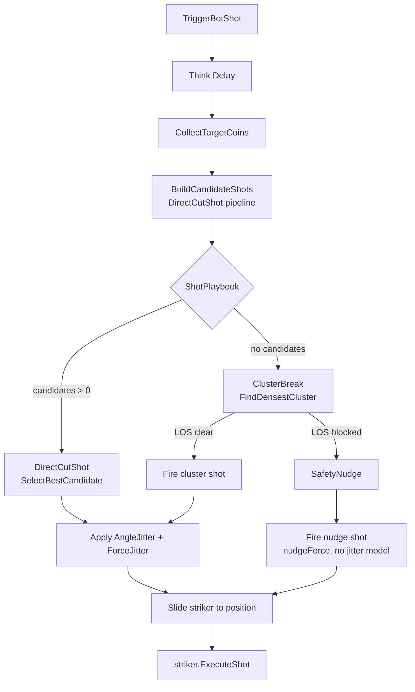

# Design Document — carrom-bot-brain-2

## Overview

Bot Brain 2.0 upgrades `CarromAIBrain` in-place. The three core changes are:

1. **Physics-Aware Force Model** — replaces `distance * forceMultiplier` with a formula that accounts for cut-angle energy loss and Unity linear drag.
2. **Shot Playbook** — a three-state decision tree (DirectCutShot → ClusterBreak → SafetyNudge) replaces the single-strategy loop.
3. **Difficulty-Tiered Humanization** — Gaussian jitter on angle (pre-geometry) and force (post-calculation) replaces the flat `errorMarginCone` post-hoc rotation.

All logic remains server-side. No changes to `StrikerController`, `CarromGameManager`, or any RPC pathway.

---

## Architecture



---

## Components and Interfaces

### CarromAIBrain (upgraded in-place)

All new logic lives inside the existing class. No new MonoBehaviours or ScriptableObjects.

**New private methods:**
- `ComputePhysicsForce(strikerPos, ghostCoinPos, coinPos, pocketPos, cutAngleDeg)` → `float`
- `FindDensestCluster(out Vector2 centroid, out int clusterSize)` → `bool`
- `ExecuteClusterBreak(SeatData, Vector2 centroid, int clusterSize)` → `IEnumerator`
- `ExecuteSafetyNudge(SeatData)` → `IEnumerator`
- `static SampleGaussian(float mean, float stdDev)` → `float`
- `GetDifficultyScale()` → `float`

**Modified methods:**
- `BuildCandidateShots` — calls `ComputePhysicsForce` instead of `distance * forceMultiplier`; applies `AngleJitter` before `ComputeGhostCoinPos`
- `BotShotRoutine` — implements the three-branch playbook; applies `ForceJitter` before `ExecuteShot`; removes `errorMarginCone` rotation

**Removed fields:** `forceMultiplier`, `errorMarginCone`

### External APIs (unchanged)

| Method | Owner | Called by |
|---|---|---|
| `striker.ExecuteShot(dir, force)` | StrikerController | BotShotRoutine (all branches) |
| `striker.ResetToBaseline(seatIndex)` | StrikerController | BotShotRoutine (all branches) |
| `striker.BroadcastPositionToClients()` | StrikerController | BotShotRoutine (all branches) |
| `BoardScript.GetPocketPositions()` | BoardScript | BuildCandidateShots |
| `BoardScript.GetBaseline(seatIndex)` | BoardScript | BuildCandidateShots, ClusterBreak, SafetyNudge |
| `pieceRegistry.GetPiece(id)` | PieceRegistry | CollectTargetCoins, FindDensestCluster, SafetyNudge |

---

## Data Models

### BotDifficulty enum

```csharp
public enum BotDifficulty { Easy, Medium, Hard }
```

Defined at file scope (outside the class) so it is visible in the Inspector dropdown.

### difficultyScale mapping

| Difficulty | difficultyScale | AngleJitter stdDev | ForceJitter stdDev |
|---|---|---|---|
| Easy | 1.0 | angleJitterMaxDeg × 1.0 | forceJitterMaxFraction × 1.0 |
| Medium | 0.5 | angleJitterMaxDeg × 0.5 | forceJitterMaxFraction × 0.5 |
| Hard | 0.25 | angleJitterMaxDeg × 0.25 | 0 (no ForceJitter) |

### Inspector field layout

```
[Header("Bot Behavior")]
  raycastLayerMask, coinRadius, minThinkTime, maxThinkTime, aimingSpeed, positionSnapThreshold
  cutAngleWeight, distanceWeight, clusteringWeight   ← scoring weights, retained

[Header("Physics Force Model")]
  linearDrag, dragDistanceScale, minForce, maxForce

[Header("Shot Playbook")]
  (no extra fields — playbook is purely code-driven)

[Header("Cluster Break")]
  clusterDetectionRadius, clusterBreakForceBase, clusterBreakForcePerCoin

[Header("Safety Nudge")]
  nudgeForce

[Header("Difficulty & Humanization")]
  difficulty (BotDifficulty enum), angleJitterMaxDeg, forceJitterMaxFraction
```

### Physics Force Formula

```
totalDistance       = Distance(strikerPos, ghostCoinPos) + Distance(coinPos, pocketPos)
cutAngleRad         = CutAngle in radians
energyTransfer      = Clamp(cos(cutAngleRad), 0.15, 1.0)
dragCompensation    = 1 + (linearDrag * totalDistance * dragDistanceScale)
forceMagnitude      = totalDistance * dragCompensation / energyTransfer
forceMagnitude      = Clamp(forceMagnitude, minForce, maxForce)
```

### AngleJitter application

```
jitteredCutAngleDeg = cutAngleDeg + SampleGaussian(0, angleJitterMaxDeg * difficultyScale)
ghostCoinPos        = ComputeGhostCoinPos(coinPos, pocketPos, jitteredCutAngleDeg)
```

The jitter rotates the coin→pocket direction by the sampled angle before deriving the ghost coin position, so the error propagates through the full geometry.

### ForceJitter application

```
forceJitterFactor   = SampleGaussian(1.0, forceJitterMaxFraction * difficultyScale)
                      (Hard difficulty: stdDev = 0, so factor = 1.0 exactly)
finalForce          = Clamp(forceMagnitude * forceJitterFactor, minForce, maxForce)
```

### Box-Muller transform

```
U1 = Random.value clamped to (0, 1]
U2 = Random.value clamped to (0, 1]
z  = sqrt(-2 * ln(U1)) * cos(2π * U2)
return mean + stdDev * z
```

---

## Correctness Properties

*A property is a characteristic or behavior that should hold true across all valid executions of a system — essentially, a formal statement about what the system should do. Properties serve as the bridge between human-readable specifications and machine-verifiable correctness guarantees.*

### Property 1: Physics force is within bounds

*For any* valid striker position, ghost coin position, coin position, pocket position, and cut angle, `ComputePhysicsForce` SHALL return a value in `[minForce, maxForce]`.

**Validates: Requirements 1.4**

### Property 2: EnergyTransferCoefficient is never below 0.15

*For any* cut angle in degrees, the computed `energyTransfer = Clamp(cos(cutAngleRad), 0.15, 1.0)` SHALL be in `[0.15, 1.0]`, preventing division by near-zero.

**Validates: Requirements 1.2**

### Property 3: Gaussian sampling returns mean when stdDev is zero

*For any* mean value `m`, `SampleGaussian(m, 0)` SHALL return exactly `m`.

**Validates: Requirements 6.2**

### Property 4: Gaussian samples are normally distributed (mean/stdDev contract)

*For any* mean and positive stdDev, a large sample of `SampleGaussian` calls SHALL have a sample mean within a small epsilon of `mean` and a sample standard deviation within a small epsilon of `stdDev`.

**Validates: Requirements 6.1**

### Property 5: Hard difficulty applies no ForceJitter

*For any* shot computed at `Hard` difficulty, the `forceJitterFactor` SHALL equal 1.0 (i.e., `SampleGaussian(1.0, 0)` is called), leaving `forceMagnitude` unchanged by jitter.

**Validates: Requirements 5.4**

### Property 6: Playbook priority is respected

*For any* board state where `BuildCandidateShots` returns at least one candidate, the selected strategy SHALL be `DirectCutShot` (not `ClusterBreak` or `SafetyNudge`).

**Validates: Requirements 2.2**

### Property 7: SafetyNudge fires when no other strategy is available

*For any* board state where `BuildCandidateShots` returns zero candidates AND `FindDensestCluster` returns false, the selected strategy SHALL be `SafetyNudge`.

**Validates: Requirements 2.4**

### Property 8: ClusterBreak force is within bounds

*For any* cluster of size N, `clusterBreakForceBase + N * clusterBreakForcePerCoin` clamped to `maxForce` SHALL be in `[clusterBreakForceBase, maxForce]`.

**Validates: Requirements 3.3**

---

## Error Handling

| Scenario | Handling |
|---|---|
| `CollectTargetCoins` returns null | `BotShotRoutine` falls through to `ExecuteFallbackShot` (unchanged) |
| `BuildCandidateShots` returns empty list | Playbook advances to ClusterBreak |
| `FindDensestCluster` returns false (no cluster ≥ 2) | Playbook advances to SafetyNudge |
| SafetyNudge: no live coins | `ExecuteFallbackShot` + `Debug.LogWarning` |
| ClusterBreak: striker LOS blocked | Fall through to SafetyNudge |
| `SampleGaussian` called with stdDev = 0 | Returns mean directly, no transform computed |
| Force clamped below minForce | Clamped silently — minForce guarantees coin reaches the board |

---

## Testing Strategy

### Unit Tests

Focus on pure functions that have no Unity physics dependency:

- `ComputePhysicsForce` — verify formula with known inputs, verify clamp behavior at extremes
- `SampleGaussian(mean, 0)` — verify returns mean exactly
- `ScoreCandidate` — verify weights sum correctly
- `GetDifficultyScale` — verify returns 1.0 / 0.5 / 0.25 for each enum value

### Property-Based Tests

Use a property-based testing library (e.g., **FsCheck** for Unity C# or a custom fast-check port). Each test runs a minimum of **100 iterations**.

Tag format: `// Feature: carrom-bot-brain-2, Property {N}: {property_text}`

| Property | Test description |
|---|---|
| P1: Force bounds | Generate random distances and cut angles; assert result ∈ [minForce, maxForce] |
| P2: EnergyTransfer bounds | Generate random cut angles; assert Clamp(cos(rad), 0.15, 1.0) ∈ [0.15, 1.0] |
| P3: Gaussian stdDev=0 | For any mean, assert SampleGaussian(mean, 0) == mean |
| P4: Gaussian distribution | Generate 1000 samples; assert |sampleMean - mean| < 0.1 and |sampleStdDev - stdDev| < 0.2 |
| P5: Hard no ForceJitter | Assert forceJitterFactor == 1.0 when difficulty == Hard |
| P6: Playbook priority | Mock board with candidates; assert strategy == DirectCutShot |
| P7: SafetyNudge fallback | Mock board with no candidates and no cluster; assert strategy == SafetyNudge |
| P8: ClusterBreak force bounds | Generate random cluster sizes; assert force ∈ [clusterBreakForceBase, maxForce] |
