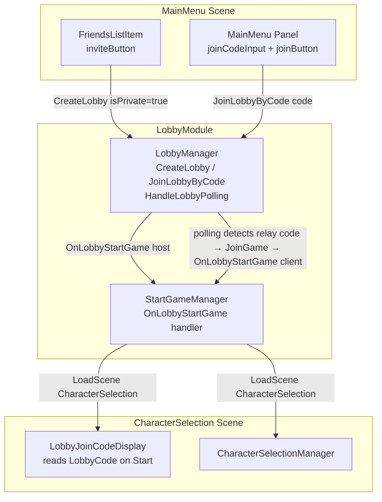

# Design Document: Friend Challenge / Private Lobby Invite

## Overview

This feature adds a private lobby invite flow to the Carrom multiplayer game. A player taps
**Invite** next to a friend's name, which creates a private UGS Lobby and navigates the host to
the existing CharacterSelection scene. The join code is displayed there so the host can share it
out-of-band. The invited friend types the code on the main menu and joins via the existing
relay-polling path. No new scenes are introduced; no push notifications or Cloud Save are used.

The implementation touches four existing files and adds one new MonoBehaviour:

| File | Change |
|---|---|
| `Scripts/Menu/FriendsListItem.cs` | Swap `removeButton` → `inviteButton`; add `InviteFriend()` |
| `Scripts/Menu/MainMenuManager.cs` | Add `joinCodeInput`, `joinButton`; add `JoinByCode()` |
| `LobbyModule/Scripts/LobbyManager.cs` | Add try/catch + ErrorMenu to `JoinLobbyByCode`; no other changes |
| CharacterSelection scene | Add `LobbyJoinCodeDisplay` GameObject |
| `Scripts/Menu/LobbyJoinCodeDisplay.cs` | New MonoBehaviour — reads and displays `LobbyCode` |

---

## Architecture

### Component Diagram



### Host (Invite) Data Flow

```
Player taps Invite on FriendsListItem
  → inviteButton.interactable = false
  → LobbyManager.CreateLobby("Carrom", 2, isPrivate:true, GameMode.Carrom)
      ├─ success → joinedLobby set, IsHost=true
      │            OnLobbyStartGame fires
      │              → StartGameManager.CreateRelay()
      │              → LoadingSceneManager.LoadScene(CharacterSelection)
      │              → LobbyJoinCodeDisplay.Start() reads joinedLobby.LobbyCode → shows code
      └─ failure → ErrorMenu.Open("Failed to create lobby.")
                   inviteButton.interactable = true
```

### Client (Join-by-Code) Data Flow

```
Player types code in joinCodeInput, taps Join
  → joinButton.interactable = false, joinCodeInput.interactable = false
  → LobbyManager.JoinLobbyByCode(code.Trim())
      ├─ success → joinedLobby set, OnJoinedLobby fires
      │            HandleLobbyPolling (Update loop) detects KEY_RELAY_JOIN_CODE != ""
      │              → JoinGame(relayCode) → IsHost=false, OnLobbyStartGame fires
      │              → StartGameManager.JoinRelay()
      │              → LoadingSceneManager.LoadScene(CharacterSelection)
      │              → LobbyJoinCodeDisplay.Start() reads joinedLobby.LobbyCode → shows code
      └─ failure → ErrorMenu.Open("Failed to join lobby.")
                   joinButton.interactable = true, joinCodeInput.interactable = true
```

---

## Components and Interfaces

### FriendsListItem.cs

Replace the `removeButton` serialized field with `inviteButton`. Comment out `RemoveFriend` and
its listener registration. Add `InviteFriend()`.

```csharp
[SerializeField] private Button inviteButton = null;
// [SerializeField] private Button removeButton = null;  // commented out

private void Start()
{
    inviteButton.onClick.AddListener(InviteFriend);
    // removeButton.onClick.AddListener(RemoveFriend);  // commented out
}

private async void InviteFriend()
{
    inviteButton.interactable = false;
    try
    {
        LobbyManager.Instance.CreateLobby("Carrom", 2, true, GameMode.Carrom);
    }
    catch
    {
        inviteButton.interactable = true;
        ErrorMenu panel = (ErrorMenu)PanelManager.GetSingleton("error");
        panel.Open(ErrorMenu.Action.None, "Failed to create lobby.", "OK");
    }
}
```

Note: `CreateLobby` is `async void` internally and fires `OnLobbyStartGame` on success, which
navigates away from the scene — so the button re-enable on success is not needed (the scene
transitions). On failure the catch re-enables it.

### MainMenu.cs (MainMenuManager)

Add two serialized fields and a `JoinByCode()` method. Wire in `Initialize()`.

```csharp
[SerializeField] private TMP_InputField joinCodeInput = null;
[SerializeField] private Button joinButton = null;

// In Initialize():
if (joinButton != null) joinButton.onClick.AddListener(JoinByCode);

private async void JoinByCode()
{
    string code = joinCodeInput.text.Trim();
    if (string.IsNullOrEmpty(code)) return;

    joinButton.interactable = false;
    joinCodeInput.interactable = false;
    try
    {
        LobbyManager.Instance.JoinLobbyByCode(code);
    }
    catch
    {
        joinButton.interactable = true;
        joinCodeInput.interactable = true;
        ErrorMenu panel = (ErrorMenu)PanelManager.GetSingleton("error");
        panel.Open(ErrorMenu.Action.None, "Failed to join lobby.", "OK");
    }
}
```

Re-enable logic: on success the scene transitions away; on failure the catch re-enables both
controls. No additional re-enable path is needed.

### LobbyManager.cs — JoinLobbyByCode

The current implementation has no error handling. Wrap in try/catch and show ErrorMenu on failure.
No other changes — the existing `HandleLobbyPolling` loop already handles the client transition:
once `joinedLobby` is set, the poll detects `KEY_RELAY_JOIN_CODE != ""` and calls `JoinGame()`,
which fires `OnLobbyStartGame`. This path is identical for public and private lobbies and requires
no modification.

```csharp
public async void JoinLobbyByCode(string lobbyCode)
{
    Player player = GetPlayer();
    try
    {
        Lobby lobby = await LobbyService.Instance.JoinLobbyByCodeAsync(lobbyCode,
            new JoinLobbyByCodeOptions { Player = player });
        joinedLobby = lobby;
        OnJoinedLobby?.Invoke(this, new LobbyEventArgs { lobby = lobby });
    }
    catch
    {
        ErrorMenu panel = (ErrorMenu)PanelManager.GetSingleton("error");
        panel.Open(ErrorMenu.Action.None, "Failed to join lobby. Check the code and try again.", "OK");
    }
}
```

### LobbyJoinCodeDisplay.cs (new)

A minimal MonoBehaviour added to the CharacterSelection scene. Reads the lobby code on `Start()`
and displays it. Shown for all lobbies (public and private) — no conditional logic needed.

```csharp
using TMPro;
using UnityEngine;

public class LobbyJoinCodeDisplay : MonoBehaviour
{
    [SerializeField] private TextMeshProUGUI codeText = null;

    private void Start()
    {
        Lobby lobby = LobbyManager.Instance.GetJoinedLobby();
        codeText.text = lobby != null ? lobby.LobbyCode : "";
    }
}
```

---

## Data Models

No new data models. The feature uses existing UGS Lobby fields:

| Field | Source | Usage |
|---|---|---|
| `Lobby.LobbyCode` | UGS Lobby SDK | Displayed in CharacterSelection; entered by joining player |
| `Lobby.IsPrivate` | UGS Lobby SDK | Set to `true` via `CreateLobbyOptions.IsPrivate` |
| `Lobby.Data[KEY_RELAY_JOIN_CODE]` | LobbyManager constant | Polled by client to detect when host has started relay |
| `LobbyManager.IsHost` | Static bool | Set by `CreateLobby` (true) and `JoinGame` (false) |

---

## Correctness Properties

*A property is a characteristic or behavior that should hold true across all valid executions of a
system — essentially, a formal statement about what the system should do. Properties serve as the
bridge between human-readable specifications and machine-verifiable correctness guarantees.*

### Property 1: Invite triggers private lobby creation

*For any* FriendsListItem initialized with a valid relationship, pressing the Invite button should
result in `LobbyManager.CreateLobby` being called with `isPrivate = true` and `maxPlayers = 2`.

**Validates: Requirements 1.2, 2.1**

---

### Property 2: Invite button disabled during creation

*For any* FriendsListItem, immediately after the Invite button is pressed and before the async
`CreateLobby` call completes, the Invite button should have `interactable = false`.

**Validates: Requirements 1.3**

---

### Property 3: Invite button re-enabled on failure

*For any* FriendsListItem where `CreateLobby` throws an exception, the Invite button should be
re-enabled (`interactable = true`) after the error is handled.

**Validates: Requirements 1.4**

---

### Property 4: Successful lobby creation fires OnLobbyStartGame

*For any* call to `CreateLobby` that succeeds, the `OnLobbyStartGame` event should fire exactly
once, carrying the newly created lobby.

**Validates: Requirements 2.2**

---

### Property 5: Join code displayed for any joined lobby

*For any* lobby (public or private) that is set as `joinedLobby` when the CharacterSelection scene
loads, `LobbyJoinCodeDisplay` should display a text value equal to `lobby.LobbyCode`.

**Validates: Requirements 3.1**

---

### Property 6: Join button triggers JoinLobbyByCode with trimmed input

*For any* non-empty string entered in `joinCodeInput`, pressing the Join button should result in
`LobbyManager.JoinLobbyByCode` being called with the whitespace-trimmed version of that string.

**Validates: Requirements 4.2**

---

### Property 7: Join controls disabled during join operation

*For any* MainMenu state where a join operation is in progress, both `joinButton` and
`joinCodeInput` should have `interactable = false` until the operation completes.

**Validates: Requirements 4.5, 4.6**

---

### Property 8: Client transitions to CharacterSelection after relay code appears

*For any* joined lobby where `KEY_RELAY_JOIN_CODE` transitions from `""` to a non-empty value,
`HandleLobbyPolling` should call `JoinGame`, which fires `OnLobbyStartGame` exactly once.

**Validates: Requirements 4.3**

---

## Error Handling

| Scenario | Handler | User-visible result |
|---|---|---|
| `CreateLobby` UGS exception | `FriendsListItem.InviteFriend` catch | ErrorMenu: "Failed to create lobby." — Invite button re-enabled |
| `JoinLobbyByCode` UGS exception (bad code, full, not found) | `LobbyManager.JoinLobbyByCode` catch | ErrorMenu: "Failed to join lobby. Check the code and try again." — Join controls re-enabled |
| Empty join code input | `MainMenu.JoinByCode` early return | No action, no error shown |
| `LobbyJoinCodeDisplay` — no joined lobby | Null check in `Start()` | `codeText.text = ""` — silent, no crash |

---

## Testing Strategy

### Unit Tests

Focus on specific examples and error conditions:

- Verify `LobbyJoinCodeDisplay.Start()` sets `codeText.text` to the lobby code when a lobby exists
- Verify `LobbyJoinCodeDisplay.Start()` sets `codeText.text` to `""` when no lobby is joined
- Verify `MainMenu.JoinByCode()` does nothing when `joinCodeInput.text` is empty or whitespace
- Verify `JoinLobbyByCode` opens ErrorMenu when `LobbyService` throws

### Property-Based Tests

Use a property-based testing library (e.g., **FsCheck** for Unity/C# or **fast-check** if tests
run in a JS harness). Each test runs a minimum of **100 iterations**.

Each test is tagged with:
`// Feature: friend-challenge-invite, Property {N}: {property_text}`

| Property | Test description |
|---|---|
| Property 1 | Generate random `Relationship` objects → press Invite → assert `CreateLobby(_, 2, true, _)` called |
| Property 2 | Generate random relationships → press Invite → assert `inviteButton.interactable == false` before await resolves |
| Property 3 | Generate random relationships with mocked failing `LobbyService` → assert button re-enabled after catch |
| Property 4 | Generate random lobby names/modes → call `CreateLobby` with mocked success → assert `OnLobbyStartGame` fires once |
| Property 5 | Generate random lobby codes → set `joinedLobby` mock → load display → assert `codeText.text == lobbyCode` |
| Property 6 | Generate random strings with leading/trailing whitespace → set as input → press Join → assert `JoinLobbyByCode(trimmed)` called |
| Property 7 | Generate random join operations → assert both controls are `interactable=false` during operation and `true` after |
| Property 8 | Generate random relay codes → simulate polling tick with non-empty relay code → assert `OnLobbyStartGame` fires once |

Property tests and unit tests are complementary: unit tests catch concrete edge cases (empty
input, null lobby), property tests verify the general rules hold across all inputs.
