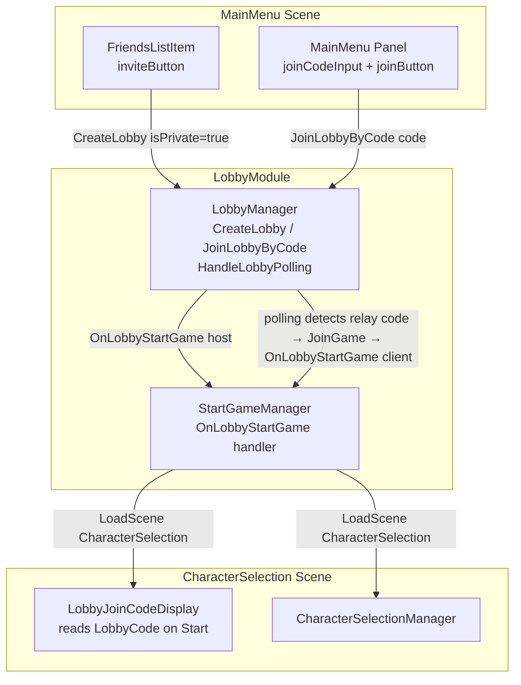
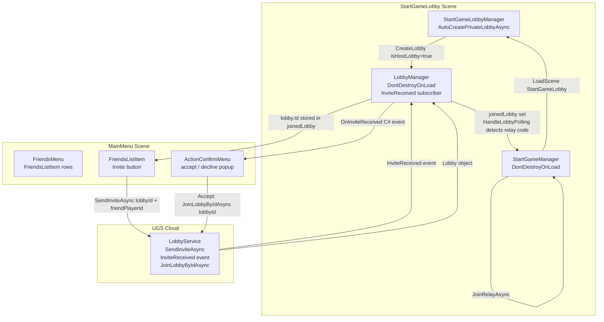

# Design Document: Friend Challenge / Private Lobby Invite

## Overview

This feature adds a private lobby invite flow to the Carrom multiplayer game. A player taps
**Invite** next to a friend's name, which creates a private UGS Lobby and navigates the host to
the existing CharacterSelection scene. The join code is displayed there so the host can share it
out-of-band. The invited friend types the code on the main menu and joins via the existing
relay-polling path. No new scenes are introduced; no push notifications or Cloud Save are used.

The implementation touches four existing files and adds one new MonoBehaviour:

| File | Change |
|---|---|
| `Scripts/Menu/FriendsListItem.cs` | Swap `removeButton` → `inviteButton`; add `InviteFriend()` |
| `Scripts/Menu/MainMenuManager.cs` | Add `joinCodeInput`, `joinButton`; add `JoinByCode()` |
| `LobbyModule/Scripts/LobbyManager.cs` | Add try/catch + ErrorMenu to `JoinLobbyByCode`; no other changes |
| CharacterSelection scene | Add `LobbyJoinCodeDisplay` GameObject |
| `Scripts/Menu/LobbyJoinCodeDisplay.cs` | New MonoBehaviour — reads and displays `LobbyCode` |

---

## Architecture

### Component Diagram



### Host (Invite) Data Flow

```
Player taps Invite on FriendsListItem
  → inviteButton.interactable = false
  → LobbyManager.CreateLobby("Carrom", 2, isPrivate:true, GameMode.Carrom)
      ├─ success → joinedLobby set, IsHost=true
      │            OnLobbyStartGame fires
      │              → StartGameManager.CreateRelay()
      │              → LoadingSceneManager.LoadScene(CharacterSelection)
      │              → LobbyJoinCodeDisplay.Start() reads joinedLobby.LobbyCode → shows code
      └─ failure → ErrorMenu.Open("Failed to create lobby.")
                   inviteButton.interactable = true
```

### Client (Join-by-Code) Data Flow

```
Player types code in joinCodeInput, taps Join
  → joinButton.interactable = false, joinCodeInput.interactable = false
  → LobbyManager.JoinLobbyByCode(code.Trim())
      ├─ success → joinedLobby set, OnJoinedLobby fires
      │            HandleLobbyPolling (Update loop) detects KEY_RELAY_JOIN_CODE != ""
      │              → JoinGame(relayCode) → IsHost=false, OnLobbyStartGame fires
      │              → StartGameManager.JoinRelay()
      │              → LoadingSceneManager.LoadScene(CharacterSelection)
      │              → LobbyJoinCodeDisplay.Start() reads joinedLobby.LobbyCode → shows code
      └─ failure → ErrorMenu.Open("Failed to join lobby.")
                   joinButton.interactable = true, joinCodeInput.interactable = true
```

---

## Components and Interfaces

### FriendsListItem.cs

Replace the `removeButton` serialized field with `inviteButton`. Comment out `RemoveFriend` and
its listener registration. Add `InviteFriend()`.

```csharp
[SerializeField] private Button inviteButton = null;
// [SerializeField] private Button removeButton = null;  // commented out

private void Start()
{
    inviteButton.onClick.AddListener(InviteFriend);
    // removeButton.onClick.AddListener(RemoveFriend);  // commented out
}

private async void InviteFriend()
{
    inviteButton.interactable = false;
    try
    {
        LobbyManager.Instance.CreateLobby("Carrom", 2, true, GameMode.Carrom);
    }
    catch
    {
        inviteButton.interactable = true;
        ErrorMenu panel = (ErrorMenu)PanelManager.GetSingleton("error");
        panel.Open(ErrorMenu.Action.None, "Failed to create lobby.", "OK");
    }
}
```

Note: `CreateLobby` is `async void` internally and fires `OnLobbyStartGame` on success, which
navigates away from the scene — so the button re-enable on success is not needed (the scene
transitions). On failure the catch re-enables it.

### MainMenu.cs (MainMenuManager)

Add two serialized fields and a `JoinByCode()` method. Wire in `Initialize()`.

```csharp
[SerializeField] private TMP_InputField joinCodeInput = null;
[SerializeField] private Button joinButton = null;

// In Initialize():
if (joinButton != null) joinButton.onClick.AddListener(JoinByCode);

private async void JoinByCode()
{
    string code = joinCodeInput.text.Trim();
    if (string.IsNullOrEmpty(code)) return;

    joinButton.interactable = false;
    joinCodeInput.interactable = false;
    try
    {
        LobbyManager.Instance.JoinLobbyByCode(code);
    }
    catch
    {
        joinButton.interactable = true;
        joinCodeInput.interactable = true;
        ErrorMenu panel = (ErrorMenu)PanelManager.GetSingleton("error");
        panel.Open(ErrorMenu.Action.None, "Failed to join lobby.", "OK");
    }
}
```

Re-enable logic: on success the scene transitions away; on failure the catch re-enables both
controls. No additional re-enable path is needed.

### LobbyManager.cs — JoinLobbyByCode

The current implementation has no error handling. Wrap in try/catch and show ErrorMenu on failure.
No other changes — the existing `HandleLobbyPolling` loop already handles the client transition:
once `joinedLobby` is set, the poll detects `KEY_RELAY_JOIN_CODE != ""` and calls `JoinGame()`,
which fires `OnLobbyStartGame`. This path is identical for public and private lobbies and requires
no modification.

```csharp
public async void JoinLobbyByCode(string lobbyCode)
{
    Player player = GetPlayer();
    try
    {
        Lobby lobby = await LobbyService.Instance.JoinLobbyByCodeAsync(lobbyCode,
            new JoinLobbyByCodeOptions { Player = player });
        joinedLobby = lobby;
        OnJoinedLobby?.Invoke(this, new LobbyEventArgs { lobby = lobby });
    }
    catch
    {
        ErrorMenu panel = (ErrorMenu)PanelManager.GetSingleton("error");
        panel.Open(ErrorMenu.Action.None, "Failed to join lobby. Check the code and try again.", "OK");
    }
}
```

### LobbyJoinCodeDisplay.cs (new)

A minimal MonoBehaviour added to the CharacterSelection scene. Reads the lobby code on `Start()`
and displays it. Shown for all lobbies (public and private) — no conditional logic needed.

```csharp
using TMPro;
using UnityEngine;

public class LobbyJoinCodeDisplay : MonoBehaviour
{
    [SerializeField] private TextMeshProUGUI codeText = null;

    private void Start()
    {
        Lobby lobby = LobbyManager.Instance.GetJoinedLobby();
        codeText.text = lobby != null ? lobby.LobbyCode : "";
    }
}
```

---

## Data Models

No new data models. The feature uses existing UGS Lobby fields:

| Field | Source | Usage |
|---|---|---|
| `Lobby.LobbyCode` | UGS Lobby SDK | Displayed in CharacterSelection; entered by joining player |
| `Lobby.IsPrivate` | UGS Lobby SDK | Set to `true` via `CreateLobbyOptions.IsPrivate` |
| `Lobby.Data[KEY_RELAY_JOIN_CODE]` | LobbyManager constant | Polled by client to detect when host has started relay |
| `LobbyManager.IsHost` | Static bool | Set by `CreateLobby` (true) and `JoinGame` (false) |

---

## Correctness Properties

*A property is a characteristic or behavior that should hold true across all valid executions of a
system — essentially, a formal statement about what the system should do. Properties serve as the
bridge between human-readable specifications and machine-verifiable correctness guarantees.*

### Property 1: Invite triggers private lobby creation

*For any* FriendsListItem initialized with a valid relationship, pressing the Invite button should
result in `LobbyManager.CreateLobby` being called with `isPrivate = true` and `maxPlayers = 2`.

**Validates: Requirements 1.2, 2.1**

---

### Property 2: Invite button disabled during creation

*For any* FriendsListItem, immediately after the Invite button is pressed and before the async
`CreateLobby` call completes, the Invite button should have `interactable = false`.

**Validates: Requirements 1.3**

---

### Property 3: Invite button re-enabled on failure

*For any* FriendsListItem where `CreateLobby` throws an exception, the Invite button should be
re-enabled (`interactable = true`) after the error is handled.

**Validates: Requirements 1.4**

---

### Property 4: Successful lobby creation fires OnLobbyStartGame

*For any* call to `CreateLobby` that succeeds, the `OnLobbyStartGame` event should fire exactly
once, carrying the newly created lobby.

**Validates: Requirements 2.2**

---

### Property 5: Join code displayed for any joined lobby

*For any* lobby (public or private) that is set as `joinedLobby` when the CharacterSelection scene
loads, `LobbyJoinCodeDisplay` should display a text value equal to `lobby.LobbyCode`.

**Validates: Requirements 3.1**

---

### Property 6: Join button triggers JoinLobbyByCode with trimmed input

*For any* non-empty string entered in `joinCodeInput`, pressing the Join button should result in
`LobbyManager.JoinLobbyByCode` being called with the whitespace-trimmed version of that string.

**Validates: Requirements 4.2**

---

### Property 7: Join controls disabled during join operation

*For any* MainMenu state where a join operation is in progress, both `joinButton` and
`joinCodeInput` should have `interactable = false` until the operation completes.

**Validates: Requirements 4.5, 4.6**

---

### Property 8: Client transitions to CharacterSelection after relay code appears

*For any* joined lobby where `KEY_RELAY_JOIN_CODE` transitions from `""` to a non-empty value,
`HandleLobbyPolling` should call `JoinGame`, which fires `OnLobbyStartGame` exactly once.

**Validates: Requirements 4.3**

---

## Error Handling

| Scenario | Handler | User-visible result |
|---|---|---|
| `CreateLobby` UGS exception | `FriendsListItem.InviteFriend` catch | ErrorMenu: "Failed to create lobby." — Invite button re-enabled |
| `JoinLobbyByCode` UGS exception (bad code, full, not found) | `LobbyManager.JoinLobbyByCode` catch | ErrorMenu: "Failed to join lobby. Check the code and try again." — Join controls re-enabled |
| Empty join code input | `MainMenu.JoinByCode` early return | No action, no error shown |
| `LobbyJoinCodeDisplay` — no joined lobby | Null check in `Start()` | `codeText.text = ""` — silent, no crash |

---

## Testing Strategy

### Unit Tests

Focus on specific examples and error conditions:

- Verify `LobbyJoinCodeDisplay.Start()` sets `codeText.text` to the lobby code when a lobby exists
- Verify `LobbyJoinCodeDisplay.Start()` sets `codeText.text` to `""` when no lobby is joined
- Verify `MainMenu.JoinByCode()` does nothing when `joinCodeInput.text` is empty or whitespace
- Verify `JoinLobbyByCode` opens ErrorMenu when `LobbyService` throws

### Property-Based Tests

Use a property-based testing library (e.g., **FsCheck** for Unity/C# or **fast-check** if tests
run in a JS harness). Each test runs a minimum of **100 iterations**.

Each test is tagged with:
`// Feature: friend-challenge-invite, Property {N}: {property_text}`

| Property | Test description |
|---|---|
| Property 1 | Generate random `Relationship` objects → press Invite → assert `CreateLobby(_, 2, true, _)` called |
| Property 2 | Generate random relationships → press Invite → assert `inviteButton.interactable == false` before await resolves |
| Property 3 | Generate random relationships with mocked failing `LobbyService` → assert button re-enabled after catch |
| Property 4 | Generate random lobby names/modes → call `CreateLobby` with mocked success → assert `OnLobbyStartGame` fires once |
| Property 5 | Generate random lobby codes → set `joinedLobby` mock → load display → assert `codeText.text == lobbyCode` |
| Property 6 | Generate random strings with leading/trailing whitespace → set as input → press Join → assert `JoinLobbyByCode(trimmed)` called |
| Property 7 | Generate random join operations → assert both controls are `interactable=false` during operation and `true` after |
| Property 8 | Generate random relay codes → simulate polling tick with non-empty relay code → assert `OnLobbyStartGame` fires once |

Property tests and unit tests are complementary: unit tests catch concrete edge cases (empty
input, null lobby), property tests verify the general rules hold across all inputs.


---

## Phase 2: Real-Time In-App Invite System

### Overview

Phase 2 replaces the out-of-band join-code sharing flow with a fully in-app UGS Lobby invite system. The host dispatches a server-side invite directly to a friend's UGS Player ID; the friend receives a real-time popup regardless of which scene they are in; accepting the popup joins the lobby by ID (no code entry required) and drops the receiver into the StartGameLobby scene.

The three pillars map cleanly onto existing singletons:

| Pillar | Owner | UGS API |
|---|---|---|
| A — Sender | `FriendsListItem` | `LobbyService.Instance.SendInviteAsync` |
| B — Global Listener | `LobbyManager` (DontDestroyOnLoad) | `LobbyService.Instance.InviteReceived` |
| C — Receiver UI & Resolution | `LobbyManager` → `ActionConfirmMenu` → `StartGameLobbyManager` | `LobbyService.Instance.JoinLobbyByIdAsync` |

The join-by-code flow (Phase 1) is fully preserved. No new scenes are introduced.

---

### Architecture

#### Component Diagram



#### Sender Data Flow (Pillar A)

```
Player opens Friends panel → FriendsMenu.LoadFriendsList()
  → each FriendsListItem.Initialize(relationship)
      stores memberId = relationship.Member.Id   ← UGS Player ID of the friend

Player taps Invite on a FriendsListItem
  → inviteButton.interactable = false
  → lobbyId = LobbyManager.Instance.GetJoinedLobby()?.Id
  → GUARD: if lobbyId is null
        inviteButton.interactable = true
        ErrorMenu: "No active lobby. Please wait a moment and try again."
        return
  → await LobbyService.Instance.SendInviteAsync(lobbyId, memberId)
      ├─ success → inviteButton.interactable = true  (invite sent; host stays in scene)
      └─ failure → inviteButton.interactable = true
                   ErrorMenu: "Failed to send invite."
```

#### Receiver Data Flow (Pillars B + C)

```
[Any scene — LobbyManager is always alive]

LobbyManager.Start() (or post-auth hook)
  → LobbyService.Instance.InviteReceived += OnInviteReceived

UGS pushes InviteReceivedEventArgs to the receiver's client
  → LobbyManager.OnInviteReceived(InviteReceivedEventArgs args)
      stores pendingInviteLobbyId = args.LobbyId
      stores pendingInviterName   = args.InviterName  (or args.InviterPlayerId as fallback)
      raises C# event: OnInviteReceived(pendingInviteLobbyId, pendingInviterName)

InviteNotificationHandler (new MonoBehaviour, lives on LobbyManager GameObject)
  subscribes to LobbyManager.OnInviteReceived
  → ActionConfirmMenu panel = PanelManager.GetSingleton("action_confirm")
  → panel.Open(OnInviteResponse,
               $"{pendingInviterName} invited you to a game. Accept?",
               "Accept", "Decline")

Player clicks Accept
  → OnInviteResponse(Result.Positive)
      → await LobbyManager.Instance.JoinLobbyByIdAsync(pendingInviteLobbyId)
          ├─ success → joinedLobby set
          │            HandleLobbyPolling detects KEY_RELAY_JOIN_CODE != ""
          │              → alreadyStartedGame = true
          │              → await StartGameManager.Instance.JoinRelayAsync(relayCode)
          │              → LoadingSceneManager.Instance.LoadScene(SceneName.StartGameLobby,
          │                                                        isNetworkSessionActive: false)
          └─ failure → ErrorMenu: "Failed to join lobby."

Player clicks Decline
  → OnInviteResponse(Result.Negative)
      → panel closes, pendingInviteLobbyId cleared, no lobby join
```

---

### Components and Interfaces

#### Pillar A — FriendsListItem.cs (modified)

Replace the current `CreateLobby` call with `SendInviteAsync`. The `memberId` field already stores the friend's UGS Player ID from `Initialize(relationship)`.

New Inspector fields: none — `memberId` is already populated.

Key change to `InviteFriend()`:

```csharp
// Namespace required: Unity.Services.Lobbies
private async void InviteFriend()
{
    inviteButton.interactable = false;
    try
    {
        string lobbyId = LobbyManager.Instance.GetJoinedLobby()?.Id;
        if (string.IsNullOrEmpty(lobbyId))
        {
            ErrorMenu panel = (ErrorMenu)PanelManager.GetSingleton("error");
            panel.Open(ErrorMenu.Action.None, "No active lobby. Please wait a moment and try again.", "OK");
            inviteButton.interactable = true;
            return;
        }
        await LobbyService.Instance.SendInviteAsync(lobbyId, memberId);
    }
    catch (LobbyServiceException e)
    {
        Debug.LogError($"[FriendsListItem] SendInviteAsync failed: {e.Message}");
        ErrorMenu panel = (ErrorMenu)PanelManager.GetSingleton("error");
        panel.Open(ErrorMenu.Action.None, "Failed to send invite.", "OK");
    }
    finally
    {
        inviteButton.interactable = true;
    }
}
```

UGS namespace: `Unity.Services.Lobbies` — `LobbyService.Instance.SendInviteAsync(string lobbyId, string playerId)`.

#### Pillar B — LobbyManager.cs (modified)

Subscribe to `LobbyService.Instance.InviteReceived` after UGS auth is confirmed. The safest hook is a new `SetupInviteListener()` method called from `Start()` when already signed in, and also callable from `Authenticate()` after `SignInAnonymouslyAsync` completes.

New members on `LobbyManager`:

```csharp
// C# event raised on the main thread for UI consumers
public event Action<string, string> OnInviteReceived; // (lobbyId, inviterName)

// Pending invite state — cleared on accept or decline
private string _pendingInviteLobbyId;
private string _pendingInviterName;

private void SetupInviteListener()
{
    // Guard: only subscribe once
    LobbyService.Instance.InviteReceived -= HandleInviteReceived;
    LobbyService.Instance.InviteReceived += HandleInviteReceived;
    Debug.Log("[LobbyManager] InviteReceived listener registered.");
}

// UGS SDK callback — may arrive on a background thread; marshal to main thread
private void HandleInviteReceived(InviteReceivedEventArgs args)
{
    // Unity.Services.Lobbies.InviteReceivedEventArgs fields:
    //   args.LobbyId      — string
    //   args.InviterName  — string (display name of sender)
    _pendingInviteLobbyId = args.LobbyId;
    _pendingInviterName   = args.InviterName ?? args.LobbyId; // fallback if name absent
    Debug.Log($"[LobbyManager] Invite received from '{_pendingInviterName}' for lobby {_pendingInviteLobbyId}");

    // Marshal to main thread — UGS events may fire off-thread
    MainThreadDispatcher.Enqueue(() =>
        OnInviteReceived?.Invoke(_pendingInviteLobbyId, _pendingInviterName));
}
```

`Start()` addition:

```csharp
private void Start()
{
    // ... existing code ...
    if (UnityServices.State == ServicesInitializationState.Initialized
        && AuthenticationService.Instance.IsSignedIn)
    {
        playerName = AuthenticationService.Instance.PlayerName ?? AuthenticationService.Instance.PlayerId;
        SetupInviteListener();   // ← new
    }
}
```

`Authenticate()` addition — call `SetupInviteListener()` after `SignInAnonymouslyAsync` completes.

UGS namespace: `Unity.Services.Lobbies` — `InviteReceivedEventArgs` is in this namespace.

#### Pillar B — MainThreadDispatcher (new, minimal)

UGS SDK events may fire on a background thread. A tiny dispatcher is needed to safely touch Unity UI from the callback.

```csharp
// MainThreadDispatcher.cs — attach to LobbyManager GameObject
using System;
using System.Collections.Generic;
using UnityEngine;

public class MainThreadDispatcher : MonoBehaviour
{
    private static readonly Queue<Action> _queue = new Queue<Action>();
    private static MainThreadDispatcher _instance;

    public static void Enqueue(Action action)
    {
        lock (_queue) { _queue.Enqueue(action); }
    }

    private void Awake()
    {
        _instance = this;
        DontDestroyOnLoad(gameObject);
    }

    private void Update()
    {
        lock (_queue)
        {
            while (_queue.Count > 0) _queue.Dequeue()?.Invoke();
        }
    }
}
```

This component is added to the same GameObject as `LobbyManager` in the Bootstrap/MainMenu scene.

#### Pillar C — InviteNotificationHandler.cs (new MonoBehaviour)

Lives on the `LobbyManager` GameObject (DontDestroyOnLoad). Subscribes to `LobbyManager.OnInviteReceived` and drives the UI + join resolution.

```csharp
// InviteNotificationHandler.cs
using Unity.Services.Lobbies;
using Unity.Services.Lobbies.Models;
using UnityEngine;

public class InviteNotificationHandler : MonoBehaviour
{
    private string _pendingLobbyId;

    private void OnEnable()
    {
        LobbyManager.Instance.OnInviteReceived += ShowInvitePopup;
    }

    private void OnDisable()
    {
        if (LobbyManager.Instance != null)
            LobbyManager.Instance.OnInviteReceived -= ShowInvitePopup;
    }

    private void ShowInvitePopup(string lobbyId, string inviterName)
    {
        _pendingLobbyId = lobbyId;
        ActionConfirmMenu panel = (ActionConfirmMenu)PanelManager.GetSingleton("action_confirm");
        panel.Open(
            OnInviteResponse,
            $"{inviterName} invited you to a game. Accept?",
            "Accept",
            "Decline");
    }

    private async void OnInviteResponse(ActionConfirmMenu.Result result)
    {
        if (result != ActionConfirmMenu.Result.Positive)
        {
            _pendingLobbyId = null;
            return;
        }

        try
        {
            await LobbyManager.Instance.JoinLobbyByIdAsync(_pendingLobbyId);
            // HandleLobbyPolling in LobbyManager.Update() takes over from here:
            // it detects KEY_RELAY_JOIN_CODE != "" and calls JoinRelayAsync + LoadScene.
        }
        catch (LobbyServiceException e)
        {
            Debug.LogError($"[InviteNotificationHandler] JoinLobbyByIdAsync failed: {e.Message}");
            ErrorMenu panel = (ErrorMenu)PanelManager.GetSingleton("error");
            panel.Open(ErrorMenu.Action.None, "Failed to join lobby.", "OK");
        }
        finally
        {
            _pendingLobbyId = null;
        }
    }
}
```

#### Pillar C — LobbyManager.JoinLobbyByIdAsync (new public method)

The existing `JoinLobby(Lobby lobby)` takes a full `Lobby` object. The invite flow only has a lobby ID. Add a new awaitable overload:

```csharp
// Unity.Services.Lobbies namespace
public async Task JoinLobbyByIdAsync(string lobbyId)
{
    Player player = GetPlayer();
    Lobby lobby = await LobbyService.Instance.JoinLobbyByIdAsync(lobbyId, new JoinLobbyByIdOptions
    {
        Player = player
    });
    joinedLobby = lobby;
    LastLobbyCode = lobby.LobbyCode ?? "";
    IsHost = false;
    alreadyStartedGame = false;   // reset so HandleLobbyPolling can fire JoinRelayAsync
    OnJoinedLobby?.Invoke(this, new LobbyEventArgs { lobby = lobby });
}
```

The existing `HandleLobbyPolling` loop then detects `KEY_RELAY_JOIN_CODE != ""` and calls `StartGameManager.Instance.JoinRelayAsync(relayCode)`, followed by `LoadingSceneManager.Instance.LoadScene(SceneName.StartGameLobby, isNetworkSessionActive: false)`. No changes to the polling loop are required.

---

### Data Models

No new persistent data models. The invite flow uses existing UGS types plus two transient fields on `LobbyManager`:

| Field | Type | Lifetime | Purpose |
|---|---|---|---|
| `_pendingInviteLobbyId` | `string` | Until accept/decline | Lobby ID from `InviteReceivedEventArgs` |
| `_pendingInviterName` | `string` | Until accept/decline | Display name from `InviteReceivedEventArgs` |
| `InviteReceivedEventArgs.LobbyId` | `string` | UGS SDK | Lobby to join on accept |
| `InviteReceivedEventArgs.InviterName` | `string` | UGS SDK | Shown in popup message |

#### UGS SDK Types Reference

| Type | Namespace | Usage |
|---|---|---|
| `LobbyService.Instance.SendInviteAsync(lobbyId, playerId)` | `Unity.Services.Lobbies` | Pillar A — dispatch invite |
| `LobbyService.Instance.InviteReceived` | `Unity.Services.Lobbies` | Pillar B — subscribe to incoming invites |
| `InviteReceivedEventArgs` | `Unity.Services.Lobbies` | Pillar B — event payload |
| `LobbyService.Instance.JoinLobbyByIdAsync(lobbyId, options)` | `Unity.Services.Lobbies` | Pillar C — join on accept |
| `IRelationship.Member.Id` | `Unity.Services.Friends.Models` | Pillar A — friend's UGS Player ID |

---

### Correctness Properties (Phase 2)

*A property is a characteristic or behavior that should hold true across all valid executions of a system — essentially, a formal statement about what the system should do. Properties serve as the bridge between human-readable specifications and machine-verifiable correctness guarantees.*

#### Property P2-1: Invite dispatches correct arguments

*For any* FriendsListItem initialized with a valid `Relationship` and any active joined lobby, pressing the Invite button should result in `LobbyService.SendInviteAsync` being called with exactly `(joinedLobby.Id, relationship.Member.Id)` — no other lobby ID or player ID.

**Validates: Requirements P2-A.1**

---

#### Property P2-2: Invite button disabled during async dispatch

*For any* FriendsListItem where `SendInviteAsync` is in flight, the `inviteButton.interactable` field should be `false` for the entire duration of the async call, and `true` again after the call completes (success or failure).

**Validates: Requirements P2-A.3**

---

#### Property P2-3: InviteReceived event propagates payload faithfully

*For any* `InviteReceivedEventArgs` with a given `LobbyId` and `InviterName`, when the UGS event fires, `LobbyManager.OnInviteReceived` should be raised on the main thread with exactly those same values.

**Validates: Requirements P2-B.2**

---

#### Property P2-4: Accept triggers join with correct lobby ID and stores result

*For any* pending invite with a given `lobbyId`, when the player clicks Accept, `JoinLobbyByIdAsync` should be called with that exact `lobbyId`, and on success `LobbyManager.joinedLobby` should equal the `Lobby` object returned by the service.

**Validates: Requirements P2-C.2, P2-C.3**

---

#### Property P2-5: Decline does not join any lobby

*For any* pending invite, when the player clicks Decline, `JoinLobbyByIdAsync` should never be called and `LobbyManager.joinedLobby` should remain unchanged.

**Validates: Requirements P2-C.6**

---

#### Property P2-6: Join failure shows error and does not load scene

*For any* pending invite where `JoinLobbyByIdAsync` throws a `LobbyServiceException`, the system should open the ErrorMenu with a non-empty message and should not call `LoadingSceneManager.LoadScene`.

**Validates: Requirements P2-C.7**

---

### Error Handling (Phase 2)

| Scenario | Location | Guard | User-visible result |
|---|---|---|---|
| `GetJoinedLobby()` returns null when Invite pressed | `FriendsListItem.InviteFriend` | Null check before `SendInviteAsync` | ErrorMenu: "No active lobby. Please wait a moment and try again." — button re-enabled |
| `SendInviteAsync` throws `LobbyServiceException` | `FriendsListItem.InviteFriend` catch | `LobbyServiceException` catch | ErrorMenu: "Failed to send invite." — button re-enabled via `finally` |
| `InviteReceived` fires on background thread | `LobbyManager.HandleInviteReceived` | `MainThreadDispatcher.Enqueue` | Transparent to user — event marshalled safely |
| `PanelManager.GetSingleton("action_confirm")` returns null | `InviteNotificationHandler.ShowInvitePopup` | Null check + `Debug.LogError` | Silent fail — invite lost; logged for debugging |
| `JoinLobbyByIdAsync` throws (lobby full, deleted, network) | `InviteNotificationHandler.OnInviteResponse` catch | `LobbyServiceException` catch | ErrorMenu: "Failed to join lobby." — no scene load |
| Relay code not yet written when receiver joins lobby | `LobbyManager.HandleLobbyPolling` | Existing poll loop (1.1 s interval) | Transparent — polling continues until code appears or lobby is abandoned |
| Relay code never appears (host crashed) | `LobbyManager.HandleLobbyPolling` | Timeout after N polls (design: 30 s / ~27 polls) | `LeaveLobby()` called; ErrorMenu: "Host disconnected." |
| Player already in a lobby when invite arrives | `InviteNotificationHandler.ShowInvitePopup` | No guard needed — popup shown regardless | Popup shown; player chooses to accept (leaves current lobby) or decline |

---

### Testing Strategy (Phase 2)

#### Unit Tests

- Verify `InviteNotificationHandler.ShowInvitePopup` sets `ActionConfirmMenu.messageText` to a string containing the inviter name.
- Verify `InviteNotificationHandler.OnInviteResponse(Negative)` does not call `JoinLobbyByIdAsync`.
- Verify `LobbyManager.JoinLobbyByIdAsync` sets `IsHost = false` and `alreadyStartedGame = false` on success.
- Verify `FriendsListItem.InviteFriend` returns early with ErrorMenu when `GetJoinedLobby()` is null (edge case P2-A.2).
- Verify `MainThreadDispatcher` executes enqueued actions on the next `Update()` tick.

#### Property-Based Tests

Use **FsCheck** (C#/Unity). Each test runs a minimum of **100 iterations**.

Tag format: `// Feature: friend-challenge-invite, Property P2-{N}: {property_text}`

| Property | Generator inputs | Assertion |
|---|---|---|
| P2-1: Invite dispatches correct arguments | Random `memberId` strings, random `lobbyId` strings | `SendInviteAsync` called with `(lobbyId, memberId)` — no other call |
| P2-2: Invite button disabled during async | Random relationships, mocked delayed `SendInviteAsync` | `inviteButton.interactable == false` during await; `true` after |
| P2-3: InviteReceived propagates payload | Random `LobbyId` + `InviterName` strings | `OnInviteReceived` fires on main thread with identical values |
| P2-4: Accept joins correct lobby and stores result | Random `lobbyId`, mocked `Lobby` return value | `JoinLobbyByIdAsync(lobbyId)` called; `joinedLobby == returnedLobby` |
| P2-5: Decline does not join | Random pending invite state | `JoinLobbyByIdAsync` never called; `joinedLobby` unchanged |
| P2-6: Join failure shows error, no scene load | Random `LobbyServiceException` messages | `ErrorMenu.Open` called; `LoadScene` not called |

Edge cases covered by generators:
- P2-A.2: `GetJoinedLobby()` returns null — covered by unit test (deterministic, not property)
- P2-B.3: `joinedLobby` non-null at time of invite — include in P2-4 generator by pre-setting `joinedLobby`
- P2-C.5: Relay code delayed — covered by existing Property 8 generator (relay code appears after N ticks)

Property tests and unit tests are complementary: unit tests cover deterministic edge cases (null lobby, null panel), property tests verify the general rules hold across all random inputs.
